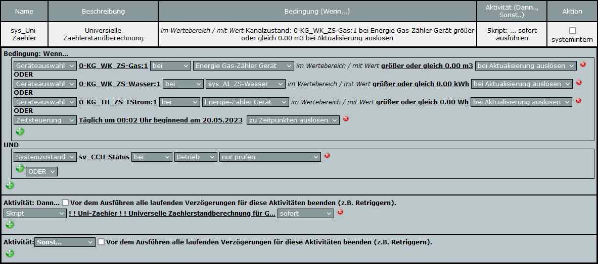
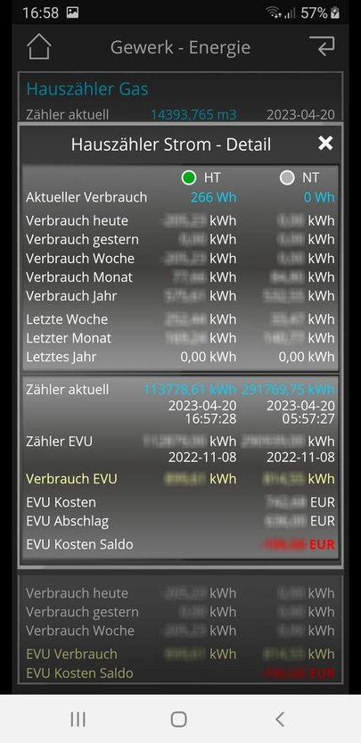

# WW-mySHT - Homematic Energiezähler-SKript mit 'universeller Konfiguration und Auswertung'

[Zurück zur Übersicht ...](../README.md)

### Funktion

Im Rahmen der Projekt-Entwicklungen zum Auslesen von Gas-, Wasser- und Stromzählern

  - [Homematic Energiezähler für Gas, Wasser und Strom mit der 'Homematic Zählersensor-Sendeeinheit 'HM-ES-TX-WM'](https://github.com/wolwin/WW-mySHP/blob/master/SHP_EZ_GWS/README.md)

  - ['AI-on-the-edge-device' Energiezähler für Gas, Wasser und Strom im Homematic Umfeld](https://github.com/wolwin/WW-mySHP/blob/master/SHP_EZ_GWS_AI/README.md)

  - [Ein Fazit zum Aufbau von Energiezählern für Gas, Wasser und Strom im Homematic Umfeld](https://github.com/wolwin/WW-mySHP/blob/master/SHP_EZ_GWS_X/README.md)

kam der Wunsch auf, ein universelles Homematic Skript für die Entgegennahme und Auswertung der Zählerablesungen einsetzen zu können. Natürlich hatten schon andere Programmautoren gute Lösungen veröffentlicht, die auch zuerst eingesetzt wurden:

  - Jens Maus - [Zählersensor HM-ES-TX-WM - Universelle Zählerstandberechnung](https://homematic-forum.de/forum/viewtopic.php?f=27&t=31353&)
  - Adaption von Michael Hansen - [Zählersensor HM-ES-TX-WM - Zählerstandberechnung - Batteriewechsel berücksichtigt](https://homematic-forum.de/forum/viewtopic.php?f=31&t=64810)

Es zeigte sich jedoch schnell, dass im Rahmen der Projektarbeit immer wieder Änderungen und Anpassungen notwendig waren, die von dem vorhandenen Skript nicht abgedeckt werden konnte. Daher wurde ausgehend von der letzten Adaptionsversion von Michael Hansen das Enegiezähler-Skript weiter entwickelt. Basierend auf der Namensgebung des jeweiligen Zählertyps (Typ: Gas, Wasser, Strom, Tarifstrom) ist es nun möglich, mehrere Zähler, auch vom gleichen Typ, dem zentralen Auswerteskript zuzuweisen. Neben einer Fehlerbereiningung wurde auch die Möglichkeit geschaffen Tarifstrom-Zähler und Zählerwerte aus Systemvariablen zu übernehmen. Eine Kostenberechnung und Kostenauswertung rundet die Erweiterungen ab.

### Details
Die Vielzahl an Aufgaben, die das 'Uni-Zaehler'-Skript abdeckt, erfordert eine korrekte Grundinstallation. Um dies dem Anwender zu erleichtern, werden weitere fünf Hilfskripte bereitgestellt, die sich um das Anlegen, Füllen und Löschen der Inhalte der Systemvariablen kümmern - oder bei Nichtgefallen, diese Systemvariablen auch wieder aus der CCU Zentrale entfernt. Diese Hilfsskripte brauchen nicht auf der CCU abgespeichert werden - sie können extern mit den eigenen Einstellungen konfiguriert und abgelegt werden - dann werden sie im 'Programme-Bereich' nach 'Skript testen' kopiert und dort einmalig ausgeführt.

Hinweis:
 - Skript-Experten können nicht nur den Namen der Systemvariablen in dem globalen Vorsatzteil des Systemvariablennamen ändern (hier: 'sys_'), sondern weitreichend auch in allen Skripten die Namensbezeichnungen selber, ohne, dass der eigentliche Code geändert werden muss. Gleiches gilt auch für die zentrale Erkennung von Zählergeräten an ihrem Namen (hier: 'ZS-'), die ausgewertet werden sollen.

  _!!! Wichtig !!! - solche Änderungen sollte man besser NICHT vornehmen ... man verliert eine evtl. Update-Möglichkeit ..._

### Homematic Skripte
Neben dem zentralen 'Uni-Zaehler' Skript gibt es noch fünf Hilfs- und Konfigurations-Skripte, die die Installation begleiten und vereinfachen:

  - 'Uni-Zaehler' Skript - [Stand 20.04.2023 - Download ...](./bin/Uni-Zaehler_20230420.zip)

  - 'Uni-Zaehler' Tool Skripte - [Stand 20.04.2023 - Download ...](./bin/Uni-Zaehler_Sys_20230420.zip)


### Installation
Bei der Installation sollten zuerst die Systemvariablen und die Werte-Konfiguration vorgenommen werden. Erst nach Abschluß dieser Arbeiten, wird das eigentliche 'Uni-Zaehler' Skript auf der Homematic Zentrale installiert.

#### Skript 'Uni-Zaehler_SysCreate.hms'
Mit diesem Konfigurations-Skript werden die notwendigen Systemvariablen angelegt. Je nach Zähler-Typ 'Gas', 'Wasser', 'Strom' oder 'TStrom' werden die gewünschten Zähler in der Variablen 'types' eingetragen. Es ist auch möglich, zuerst nur für einen Zähler die Systemvariablen anlegen zu lassen. Man kann das Skript jederzeit noch einmal mit einem weiteren eingetragenen Zähler-Typ laufen lassen, ohne dass schon vorhandene Einträge geändert werden.

Das Skript wird im WebUI der Homematic Zentrale unter 'Programme-Bereich' nach 'Skript testen' kopiert und dort einmalig ausgeführt. Im 'Ausgabe' Bereich des Fensters werden die Systemvariablen mit ihrem Status aufgelistet. Eine Speicherung des Skripts auf der Homematic Zentrale ist nicht notwendig.

```
...

! Listen-Definition, für welche Zähler die Systemvariablen angelegt werden
! sollen - es sind die Bezeichnungen der Typ-Definition der Zähler zu verwenden.
! Bei dem Einsatz von mehreren Zählern vom gleichen Typ, wird an die
! Typ-Definition eine individuelle Bezeichnung (ohne Leerzeichen) angehängt,
! sodass sich eine 'eindeutige' Liste ergibt. Die Reihenfolge der Namen für
! Zähler vom gleichen Typ muss absteigend erfolgen.
! Beispiel l: string types="Gas,Strom,Wasser,WasserG";
! Beispiel 2: wenn nur Strom-, Wasserzähler und Wasserzähler-Garten benutzt
!             werden sollen, muss die Zeile wie folgt geändert werden:
!             string types="Strom,Wasser,WasserG";
! Anmerkung : schon vorhandene Zähler-Systemvariable werden nicht geändert

string types = "Gas, Strom, Wasser";
! string types = "Gas, TStrom, Wasser";
! string types = "Gas";
! string types = "Strom";
! string types = "TStrom";
! string types = "Wasser";

! Vorsatzbezeichnung für die Systemvariablen-Namen der Zähler aus der Geräteliste
! Beispiel 1: 'xxxxYYYY_Verbrauch_aktuell' mit xxxx = 'sys_' und YYYYY = 'Gas'
!             zu 'sys_ZS-Gas_Verbrauch_aktuell'
! Beispiel 2: 'xxxxYYYY_Verbrauch_aktuell' mit xxxx = '' und YYYYY = 'Gas'
!             zu 'ZS-Gas_Verbrauch_aktuell'
! string preSysVar = "";
string preSysVar = "sys_";

...
```

#### Skript 'Uni-Zaehler_SysDelete.hms'
_!!! Achtung !!!_
<br>
Mit diesem Konfigurations-Skript werden in der Standardeinstellung _ALLE_ Systemvariablen des 'Uni-Zaehler' Skripts ohne Nachfrage gelöscht. Es ist auch möglich, für einzelne Zähler die Systemvariablen zu löschen, indem man die 'types' Variable entsprechend anpasst - die Systemvariablen für andere Zähler bleiben dabei dann unberührt.

Das Skript wird im WebUI der Homematic Zentrale unter 'Programme-Bereich' nach 'Skript testen' kopiert und dort einmalig ausgeführt. Im 'Ausgabe' Bereich des Fensters werden die Löschung der Systemvariablen mit Status aufgelistet. Eine Speicherung des Skripts auf der Homematic Zentrale ist nicht notwendig.

```
...

! Listen-Definition, für welche Zähler die Systemvariablen gelöscht werden
! sollen - es sind die Bezeichnungen der Typ-Definition der Zähler zu verwenden.
! Bei dem Einsatz von mehreren Zählern vom gleichen Typ, wird an die
! Typ-Definition eine individuelle Bezeichnung (ohne Leerzeichen) angehängt,
! sodass sich eine 'eindeutige' Liste ergibt. Die Reihenfolge der Namen für
! Zähler vom gleichen Typ muss absteigend erfolgen.
! Beispiel l: string types="Gas,Strom,Wasser,WasserG";
! Beispiel 2: wenn nur Strom-, Wasserzähler und Wasserzähler-Garten gelöscht
!             werden sollen, muss die Zeile wie folgt geändert werden:
!             string types="Strom,Wasser,WasserG";

string types = "Gas, Strom, TStrom, Wasser";
! string types = "Gas";
! string types = "Strom";
! string types = "TStrom";
! string types = "Wasser";

! Vorsatzbezeichnung für die Systemvariablen-Namen der Zähler aus der Geräteliste
! Beispiel1: 'xxxxYYYY_Verbrauch_aktuell' mit xxxx = 'sys_' und YYYYY = 'Gas'
!            zu 'sys_ZS-Gas_Verbrauch_aktuell'
! Beispiel2: 'xxxxYYYY_Verbrauch_aktuell' mit xxxx = '' und YYYYY = 'Gas'
!            zu 'ZS-Gas_Verbrauch_aktuell'
! string preSysVar = "";
string preSysVar = "sys_";

...
```

#### Skript 'Uni-Zaehler_SysWrite.hms'
Mit diesem Konfigurations-Skript wird eine Matrix mit fünf Slots für Zähler-Typen (hier beispielhaft für: 'Gas', 'Wasser', 'Strom' und 'TStrom') bereitgestellt, um Zähler- und Kosten-Werte in die zugehörigen Systemvariablen einzutragen.

Beispiel-Berechnungen für Gas und Wasser zeigen, wie sich die einzelnen Kosten- und Kostenfaktoren ergeben, die dann in die Matrix unter 'InitCounter1...5' eingetragen werden. Gleiches gilt für die Werte der EVU-Angaben. Für Tarif-Strom sind zwei Einträge mit 'TStrom-HT' und 'TStrom-NT' auszufüllen.

Man könnte nun alle Angaben in eine einzige Matrix schreiben - das ist jedoch zu unübersichtlich. Daher wurde die Matrix jeweils für vier Themen beispielhaft vordefiniert:

  - aktuelle Zählerstände
  - Zählerstände letztes Jahr
  - EVU-Zählerstände und EVU-Datum
  - Kosten

Nachdem dort alle Einträge gemacht sind, wird das Skript im WebUI der Homematic Zentrale unter 'Programme-Bereich' nach 'Skript testen' kopiert. Würde man es jetzt ausführen, passiert ... nichts. Denn es sind alle 'InitCounter' Zeilen mit '!' auskommentiert. Man geht nun her und entfernt unter den Themen in den Zeilen, deren Inhalt man in die Systemvariable schreiben möchte, am Zeilenanfang das Ausrufezeichen '!'.

Mit Druck auf den 'Ausführen' Knopf werden die Systemvariablen dann mit den Werten gefüllt. Im 'Ausgabe' Bereich des Fensters werden die Löschung der Systemvariablen mit Status aufgelistet. Eine Speicherung des Skripts auf der Homematic Zentrale ist nicht notwendig.

Hinweis:
  - Natürlich können jederzeit die Werte der Systemvariablen auch über die WebUI der Homematic Zentrale direkt eingetragen / geändert werden - es muss dieses Skript nicht zwingend ausgeführt werden. Jedoch ist es ganz hilfreich eine Art Zusammenfassung aller relevanten Parameter extern abgelegt zu haben und auf 'Knopfdruck' wieder abspielen zu können.

```
...

! Typ- und Werte-Definition für die einzelen Zähler als Text-Liste
! Allgemein: InitCounterX = "<Zaehler-Bezeichnung>,
!                            <Wert Zaehler_aktuell>,             ! aktueller Zählerstand                  oder  -1
!                            <Wert Zaehler_l_Jahr>,              ! Zählerstand letztes Jahr               oder  -1
!                            <Wert Zaehler_EVU>,                 ! Zählerstand letzte EVU-Ablesung        oder  -1
!                            <Wert Zaehler_EVU_Datum>,           ! Datum letzte EVU-Ablesung  20xx-xx-xx  oder  -1
!                            <Wert Kosten_Grundpreis>,           ! Kosten Grundpreis                      oder  -1
!                            <Wert Kosten_Preis>,                ! Kosten je Einheit                      oder  -1
!                            <Wert Kosten_Faktor>,               ! Multiplikationsfaktor je Einheit       oder  -1
!                            <Wert Kosten_AbschlagE>,            ! einzelner Abschlagsbeitrag             oder  -1
!                            <Wert Kosten_AbschlagM>,            ! monatlicher Abschlagsbeitrag           oder  -1
!                           "
! Anmerkung: es werden alle Werte '>= 0' gesetzt - alle Werte '< 0' bleiben unberücksichtigt

! --- Init Vorbelegung ohne Eintrag (nicht ändern) ---
string InitCounter1 = "Gas,        -1, -1, -1, -1, -1, -1, -1, -1, -1";
string InitCounter2 = "Wasser,     -1, -1, -1, -1, -1, -1, -1, -1, -1";
string InitCounter3 = "Strom,      -1, -1, -1, -1, -1, -1, -1, -1, -1";
string InitCounter4 = "TStrom-HT,  -1, -1, -1, -1, -1, -1, -1, -1, -1";
string InitCounter5 = "TStrom-NT,  -1, -1, -1, -1, -1, -1, -1, -1, -1";

! --- Berechnung für Gas-Eintrag 'Multiplikationsfaktor je Einheit' ---
! Gas_Brennwert = 11.5700;
! Gas_Zustandszahl = 0.9639;
! => Brennwert * Zustandszahl = 11.152323 (Kosten_Faktor)

! --- Berechnung für Wasser-Einträge ---
! Bereitstellungs- und Verrechnungsgebühr = 141,2507 pro Jahr
! Verbrauchsgebühr = 1,926 pro m3
! Schmutzwassergebühr = 2,75 pro m3
! => Wasserkosten = 4,676 pro m3
! Abschlag Trinkwasser = 254,88 pro Jahr
! Abschlag Schmutzwasser = 162,25 pro Jahr
! => Abschlag Wasser = 417,13 pro Jahr => 34,76083 pro Monat

! --- aktuellen Zählerstand eintragen ---
! InitCounter1 = "Gas,        13828.990, -1, -1, -1, -1, -1, -1, -1, -1";
! InitCounter2 = "Wasser,        41.465, -1, -1, -1, -1, -1, -1, -1, -1";
! InitCounter3 = "Strom,             -1, -1, -1, -1, -1, -1, -1, -1, -1";
! InitCounter4 = "TStrom-HT,   113400.3, -1, -1, -1, -1, -1, -1, -1, -1";
! InitCounter5 = "TStrom-NT,   291392.8, -1, -1, -1, -1, -1, -1, -1, -1";

! --- Zählerstand letztes Jahr eintragen ---
! InitCounter1 = "Gas,        -1,  13847.0, -1, -1, -1, -1, -1, -1, -1";
! InitCounter2 = "Wasser,     -1,     42.0, -1, -1, -1, -1, -1, -1, -1";
! InitCounter3 = "Strom,      -1,       -1, -1, -1, -1, -1, -1, -1, -1";
! InitCounter4 = "TStrom-HT,  -1, 113203.0, -1, -1, -1, -1, -1, -1, -1";
! InitCounter5 = "TStrom-NT,  -1, 291221.0, -1, -1, -1, -1, -1, -1, -1";

! --- EVU-Zählerstand und EVU-Datum eintragen ---
! InitCounter1 = "Gas,        -1, -1,  13550.0, 2022-11-08, -1, -1, -1, -1, -1";
! InitCounter2 = "Wasser,     -1, -1,     33.0, 2022-11-08, -1, -1, -1, -1, -1";
! InitCounter3 = "Strom,      -1, -1,       -1,         -1, -1, -1, -1, -1, -1";
! InitCounter4 = "TStrom-HT,  -1, -1, 112879.0, 2022-11-08, -1, -1, -1, -1, -1";
! InitCounter5 = "TStrom-NT,  -1, -1, 290939.0, 2022-11-08, -1, -1, -1, -1, -1";

! --- Kosten eintragen ---
! InitCounter1 = "Gas,        -1, -1, -1, -1,  25.26, 0.0686, 11.152323, -1,  72.00";
! InitCounter1 = "Gas,        -1, -1, -1, -1,  58.11, 0.1429, 11.152323, -1, 145.00";
! InitCounter2 = "Wasser,     -1, -1, -1, -1, 141.28, 4.6760,        -1, -1,  34.76";
! InitCounter3 = "Strom,      -1, -1, -1, -1,     -1,     -1,        -1, -1,  -1";
! InitCounter4 = "TStrom-HT,  -1, -1, -1, -1, 247.24, 0.3696,        -1, -1, 106.00";
! InitCounter5 = "TStrom-NT,  -1, -1, -1, -1,    0.0, 0.2749,        -1, -1,   0.00";

! Vorsatzbezeichnung für die Systemvariablen-Namen der Zähler aus der Geräteliste
! Beispiel 1: 'xxxxYYYY_Verbrauch_aktuell' mit xxxx = 'sys_' und YYYYY = 'Gas'
!             zu 'sys_ZS-Gas_Verbrauch_aktuell'
! Beispiel 2: 'xxxxYYYY_Verbrauch_aktuell' mit xxxx = '' und YYYYY = 'Gas'
!             zu 'ZS-Gas_Verbrauch_aktuell'
! string preSysVar = "";
string preSysVar = "sys_";

...
```

#### Skript 'Uni-Zaehler_SysClear.hms'
_!!! Achtung !!!_
<br>
Mit diesem Konfigurations-Skript werden in der Standardeinstellung _ALLE_ Inhalte der Systemvariablen des 'Uni-Zaehler' Skripts für die Zähler-Typen 'Gas', 'Strom' und 'Wasser' ohne Nachfrage gelöscht und zurückgesetzt. Es ist auch möglich, für einzelne Zähler die Werte der Systemvariablen zurückzusetzen, indem man die 'types' Variable entsprechend anpasst - die Systemvariablen für andere Zähler bleiben dabei dann unberührt.

Das Skript wird im WebUI der Homematic Zentrale unter 'Programme-Bereich' nach 'Skript testen' kopiert und dort einmalig ausgeführt. Im 'Ausgabe' Bereich des Fensters werden die Löschung der Systemvariablen mit Status aufgelistet. Eine Speicherung des Skripts auf der Homematic Zentrale ist nicht notwendig.

```
...

! Listen-Definition, für welche Zähler die Werte der Systemvariablen gelöscht werden
! sollen - es sind die Bezeichnungen der Typ-Definition der Zähler zu verwenden.
! Bei dem Einsatz von mehreren Zählern vom gleichen Typ, wird an die
! Typ-Definition eine individuelle Bezeichnung (ohne Leerzeichen) angehängt,
! sodass sich eine 'eindeutige' Liste ergibt. Die Reihenfolge der Namen für
! Zähler vom gleichen Typ muss absteigend erfolgen.
! Beispiel l: string types="Gas,Strom,WasserG,Wasser";
! Beispiel 2: wenn nur Strom-, Wasserzähler und Wasserzähler-Garten benutzt
!             werden sollen, muss die Zeile wie folgt geändert werden:
!             string types="Strom,WasserG,Wasser";
! Anmerkung : schon vorhandene Zähler-Systemvariable werden nicht geändert

string types = "Gas, Strom, Wasser";
! string types = "Gas, TStrom, Wasser";
! string types = "Gas";
! string types = "Strom";
! string types = "TStrom";
! string types = "Wasser";

! Vorsatzbezeichnung für die Systemvariablen-Namen der Zähler aus der Geräteliste
! Beispiel 1: 'xxxxYYYY_Verbrauch_aktuell' mit xxxx = 'sys_' und YYYYY = 'Gas'
!             zu 'sys_ZS-Gas_Verbrauch_aktuell'
! Beispiel 2: 'xxxxYYYY_Verbrauch_aktuell' mit xxxx = '' und YYYYY = 'Gas'
!             zu 'ZS-Gas_Verbrauch_aktuell'
! string preSysVar = "";
string preSysVar = "sys_";

...
```

#### Skript 'Uni-Zaehler_SysWrite-TZ.hms'
Dieses Konfigurations-Skript wird nur benötigt, wenn ein Tarifstrom-Zähler eingesetzt wird. Es werden tageweise die Umschaltzeiten zwischen dem 'HT'- und dem 'NT'-Zeitbereich definiert. Für einen Feiertag können ebenfalls Angaben eingetragen werden. Jeder Tag besteht aus mindestens einem Eintrag, der um '00:00' Uhr beginnt.

Das Skript wird im WebUI der Homematic Zentrale unter 'Programme-Bereich' nach 'Skript testen' kopiert und dort einmalig ausgeführt. Im 'Ausgabe' Bereich des Fensters werden die Zeitstempel aufgelistet. Eine Speicherung des Skripts auf der Homematic Zentrale ist nicht notwendig.

```
...

! Definition, für welchen Tarifstrom-Zähler die Systemvariablen beschrieben werden
! sollen - es sind die Bezeichnungen der Typ-Definition der Zähler zu verwenden.
! Bei dem Einsatz von mehreren Zählern vom gleichen Typ, wird an die
! Typ-Definition eine individuelle Bezeichnung (ohne Leerzeichen) angehängt,
! sodass sich eine 'eindeutige' Zähler-Bezeichnung ergibt:
! Beispiel l: string types="TStrom";
! Beispiel 2: string types="TStromXYZ";
string types = "TStrom";

! Vorsatzbezeichnung für die Systemvariablen-Namen der Zähler aus der Geräteliste
! Beispiel1: 'xxxxYYYY_Verbrauch_aktuell' mit xxxx = 'sys_' und YYYYY = 'Gas'
!            zu 'sys_ZS-Gas_Verbrauch_aktuell'
! Beispiel2: 'xxxxYYYY_Verbrauch_aktuell' mit xxxx = '' und YYYYY = 'Gas'
!            zu 'ZS-Gas_Verbrauch_aktuell'
! string preSysVar = "";
string preSysVar = "sys_";

! Beispiel 1: Die NT-Zeit gilt von Montag bis Samstag von 20.00 Uhr bis 6.00 Uhr und an Sonn- und Feiertagen ganztägig.
! Ft = 00:00,NT
! Mo = 00:00,NT;06:00,HT;20:00,NT
! Di = 00:00,NT;06:00,HT;20:00,NT
! Mi = 00:00,NT;06:00,HT;20:00,NT
! Do = 00:00,NT;06:00,HT;20:00,NT
! Fr = 00:00,NT;06:00,HT;20:00,NT
! Sa = 00:00,NT;06:00,HT;20:00,NT
! So = 00:00,NT
!
! Beispiel 2: für alle Tage ist nur der HT-Tarif aktiv
! Ft = 00:00,HT
! Mo = 00:00,HT
! Di = 00:00,HT
! Mi = 00:00,HT
! Do = 00:00,HT
! Fr = 00:00,HT
! Sa = 00:00,HT
! So = 00:00,HT
!
! Anmerkung: Die Zeiten müssen aufsteigend angeordnet werden.

string sTFt = "00:00,NT";
string sTMo = "00:00,NT ; 06:00,HT ; 20:00,NT";
string sTDi = "00:00,NT ; 06:00,HT ; 20:00,NT";
string sTMi = "00:00,NT ; 06:00,HT ; 20:00,NT";
string sTDo = "00:00,NT ; 06:00,HT ; 20:00,NT";
string sTFr = "00:00,NT ; 06:00,HT ; 20:00,NT";
string sTSa = "00:00,NT ; 06:00,HT ; 20:00,NT";
string sTSo = "00:00,NT";

...
```

#### 'Feiertagsberechnung' Skript
Das 'Feiertagsberechnung' Skript wird nur benötigt, wenn ein Tarifstrom-Zähler eingesetzt wird.

Das [Feiertagsberechnung - Skript](https://homematic-forum.de/forum/viewtopic.php?f=31&t=4058&hilit=feiertags#p23994) kann mit der Installationsanleitung im 'HomeMatic-Forum / FHZ-Forum' gefunden werden - installiert wird das 'Feiertage_V3.1_compact.txt' Skript. Das Skript wird an jedem Tag um '00:01' Uhr ausgelöst (immer zeitlich _VOR_ dem 'Uni-Zaehler' Skript, das um '00:02' Uhr startet !!):


Nach der Installation werden die Namen der Systemvariablen des 'Feiertagsberechnung' Skripts mit dem Präfix 'sys_' versehen. Dies muss auch im 'Feiertagsberechnung' Skript so geändert werden. Ausserdem sollten Feiertage, an denen keine Vergünstigung für den Tarifstrom vom EVU ausgewiesen ist (z.B.: Rosenmontag), aus der Feiertagsliste entfernt werden.


Original:
```
string sv_Bool = "Feiertag-Heute,Feiertag-Morgen";
string sv_Daten = "Feiertag-Daten,Feiertag-Eigene";
string sv_Name = "Feiertag-Heute-Name,Feiertag-Morgen-Name";
```
Änderung:
```
string sv_Bool = "sys_Feiertag-Heute,sys_Feiertag-Morgen";
string sv_Daten = "sys_Feiertag-Daten,sys_Feiertag-Eigene";
string sv_Name = "sys_Feiertag-Heute-Name,sys_Feiertag-Morgen-Name";
```

#### Skript 'Uni-Zaehler.hsm'
Das zentrale 'Uni-Zaehler'-Skript befindet sich (hier) im Programm 'sys_UniZaehler', das von unterschiedlichen Events aufgerufen wird:

  - Energie-Zähler Gerät (z.B.: 'HM-ES-TX-WM')
  - Systemvariable mit Zählerstandswert (z.B.: von 'AI-on-the-edge-device' nach Wertbereinigung)
  - Timer-Event um Mitternacht (00:02 Uhr) für die Auswertung (... um 00:01 Uhr läuft das Feiertagsskript - siehe oben)

_!!! Wichtig !!! - der Haken bei 'Vor dem Ausführen ... beenden' muss ENTFERNT sein ..._


<br><br>
Die Namensgebung des Energie-Zähler Geräts bzw. die Namensgebung der Systemvariable steuert im Skript die Auswertung - Kennung dabei ist die Zeichenfolge 'ZS-' (=> Zähler Sensor) im Namen, gefolgt von dem Zähler-Typ 'Gas', 'Wasser', 'Strom' oder 'TStrom'. Es werden nur die Zähler-Typen ausgewertet, die im 'Uni-Zaehler'-Skript zur Auswertung konfiguriert wurden und für die alle notwendigen Systemvariablen angelegt sind.

In dem Beispiel sind drei unterschiedliche Geräte-Typen konfiguriert für 'bei Aktualisierung':

- 0-KG_WK<b>_ZS-Gas</b>
  - Kellergeschoss - Waschküche - Kennung '_ZS' - Gas
  - Energie Gas-Zählergerät
  - Impulszähler an einem 'HM-ES-TX-WM' Gerät
<br><br>
- 0-KG_TH<b>_ZS-TStrom</b>
  - Kellergeschoss - Treppenhaus - Kennung '_ZS' - Tarifstrom
  - Energie Zählergerät
  - LED an einem 'HM-ES-TX-WM' Gerät
<br><br>
- sys_AI<b>_ZS-Wasser</b>
  - Systemvariable - Kennung '_ZS' - Wasser
  - enthält das Ergebnis des Korrektur-Skripts für 'AI on the edge'-Zähler

```
...

! Listen-Definition, welche Zähler ausgewertet werden sollen - es sind die
! Bezeichnungen der Typ-Definition der Zähler zu verwenden.
! Bei dem Einsatz von mehreren Zählern vom gleichen Typ, wird an die
! Typ-Definition eine individuelle Bezeichnung (ohne Leerzeichen) angehängt,
! sodass sich eine 'eindeutige' Liste ergibt. Die Reihenfolge der Namen für
! Zähler vom gleichen Typ muss absteigend erfolgen.
! Beispiel l: string types="Gas,Strom,WasserG,Wasser";
! Beispiel 2: wenn nur Strom-, Wasserzähler und Wasserzähler-Garten benutzt
!             werden sollen, muss die Zeile wie folgt geändert werden:
!             string types="Strom,WasserG,Wasser";
string types = "Gas, Strom, TStrom, Wasser";

! Vorsatzbezeichnung für die Systemvariablen-Namen der Zähler aus der Geräteliste
! Beispiel 1: 'xxxxYYYY_Verbrauch_aktuell' mit xxxx = 'sys_' und YYYYY = 'Gas'
!             zu 'sys_ZS-Gas_Verbrauch_aktuell'
! Beispiel 2: 'xxxxYYYY_Verbrauch_aktuell' mit xxxx = '' und YYYYY = 'Gas'
!             zu 'ZS-Gas_Verbrauch_aktuell'
! string preSysVar = "";
string preSysVar = "sys_";

! Global - Feiertag-Script - Feiertag-Systemvariable
! Bei Auswertung eines Tarifstrom-Zählers wird die Installation des Feiertags-Script benötigt
! https://homematic-forum.de/forum/viewtopic.php?f=31&t=4058&hilit=feiertags#p23994
! string sFeiertag_Heute = "Feiertag-Heute";  ! Original-Bezeichnung im Feiertag-Script
!
! string sFeiertag_Heute = "Feiertag-Heute";
string sFeiertag_Heute = preSysVar # "Feiertag-Heute";
object oFeiertag_Heute = null;

...
```

Nach jedem Zähler-Event, der in der Regel alle 3 Minuten von einem Zähler ausgelöst wird, werden im Skript die jeweiligen Werte für Zählerstand, Verbrauch und Kosten in den zugehörigen Systemvariablen aktualisiert. Um '00:02' Uhr löst der Timer-Event die Tages-Aktualisierung mit Monats- und Jahres-Auswertung für alle Zähler-Typen aus.

Wenn man das 'Uni-Zaehler.hsm' Skript installiert hat, kann man am Zeitstempel der zugehörigen Systemvariablen kontrollieren, ob alle Zähler korrekt eingebunden sind und das Skript die Zählerstandswerte in die zugehörigen Systemvariablen schreibt. Wenn dies der Fall ist, sollten nach einem Tageswechsel auch die Werte des Vortages unter '... gestern' zu sehen sein.

Setzt man einen Tarifstrom-Zähler ein, dann wird bei einem Energie-Zähler Gerät (z.B.: 'HM-ES-TX-WM') der 'interne Zählerstand' immer dem derzeit gültigen HT- oder NT-Zeitfenster zugeodnet. Bei einer Überschneidung von max. 3 Minuten und einer nicht minutengenauen Umschaltung des EVU kann es natürlich zu Abweichungen kommen, die sich aber über einen längeren Zeitraum ausmitteln. Bei Bedarf kann man die Umschaltzeiten des EVU 'genau' beobachten / ermitteln und dann in die Umschaltliste eintragen (siehe Skript 'Uni-Zaehler_SysWrite-TZ.hms'). <br>
Setzt man Systemvariablen mit Zählerstandswert ein, dann wird ja immer schon der 'richtige' HT- und NT-Zählerstand übermittelt - siehe 'AI-on-the-edge-device' für Tarifstrom-Zähler.

Hinweis:

  - Am Anfang kann bei der Installation der Zähler es immer einmal vorkommen, dass der eingetragene Zählerstand schnell korrigiert werden muss. Dabei hat sich die folgende Vorgehensweise über die WebGUI der Homematic Zentrale bewährt:
  <br><br>
    - für ein Energie-Zähler Gerät (z.B.: 'HM-ES-TX-WM')
      - unter 'Status und Bedienung' den Bereich mit den 'Systemvariablen' aufrufen
      - dort mit Hilfe des Filters nach 'Zaehler_aktuell' suchen
      - für den gewünschten Zähler-Typ ('Gas', 'Wasser', 'Strom', 'Tstrom-HT', 'TStrom-NT') unter 'Status' das Feld anklicken und den Wert wie gewünscht berichtigen (z.B.: 'sys_ZS-Gas_Zaehler_aktuell')
      - nach 3 Minuten sollten dann mit dem nächsten Zähler-Event alle 'abhängigen' Werte auf den korrigierten Zählerstand angepaßt sein
  <br><br>
    - für eine Systemvariable mit Zählerstandswert (z.B.: von 'AI-on-the-edge-device' nach Wertbereinigung)
      - unter 'Status und Bedienung' den Bereich mit den 'Systemvariablen' aufrufen
      - dort mit Hilfe des Filters nach 'AI_ZS' suchen
      - für den gewünschten Zähler-Typ ('Gas', 'Wasser', 'Strom', 'Tstrom-HT', 'TStrom-NT') unter 'Status' das Feld anklicken und den Wert wie gewünscht berichtigen (z.B.: 'sys_AI_ZS-Wasser')
      - nach 3 Minuten sollten dann mit dem nächsten Zähler-Event alle 'abhängigen' Werte auf den korrigierten Zählerstand angepaßt sein
  <br><br>
  - Eine Änderung von EVU- und Kosten-Angaben über das 'Uni-Zaehler_SysWrite' Skript, erfordert immer erst einen Tageswechsel, bevor alle Werte durchreifend sichtbar werden.

### Beispiele Visualisierung
Um eine generische Übersicht über alle Zähler- und Verbrauchsdaten zu erhalten wurden, die Inhalte der Systemvariablen im 'AIO CREATOR NEO' visualisiert. Die Gesamtübersicht enthält alle drei Hauszähler mit ihren wichtigsten Werten.
<br><br>

<br><br>
Klickt man in der Gesamtübersicht den 'Hauszähler Gas' an, werden alle verfügbaren Werte als Popup angezeigt.
<br><br>

<br><br>
Klickt man in der Gesamtübersicht den 'Hauszähler Wasser' an, werden alle verfügbaren Werte als Popup angezeigt.
<br><br>

<br><br>
Klickt man den 'Button Zähler' an, wird das aktuelle Zählerbild als Popup angezeigt.
<br><br>

<br><br>
Klickt man in der Gesamtübersicht den 'Hauszähler Strom' an, werden alle verfügbaren Werte als Popup angezeigt.
<br><br>


### Historie
- 2023-04-20 - Erstveröffentlichung
