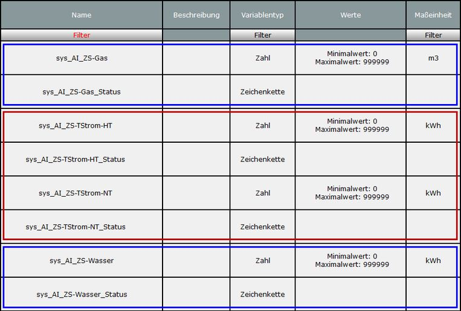
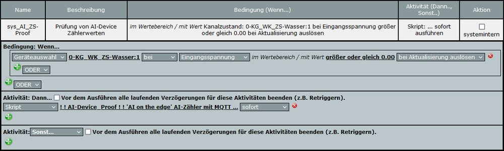

# WW-mySHT - Homematic Prüf-Skript für 'AI-on-the-edge-device' Energiezähler

[Zurück zur Übersicht ... ](../README.md)

### Funktion
Im Rahmen der Projekt-Entwicklungen zum Auslesen von 'AI-on-the-edge-device' Gas-, Wasser- und Stromzählern

  - ['AI-on-the-edge-device' Energiezähler für Gas, Wasser und Strom im Homematic Umfeld](https://github.com/wolwin/WW-mySHP/blob/master/SHP_EZ_GWS_AI/README.md)

zeigte sich, dass die übermittelten Gerätewerte des 'AI-on-the-edge-device' manchmal nicht fehlerfrei waren. Es können sich teils längere Zeitabschnitte ergeben, in denen immer wieder ein falscher Zahlenwert ermittelt wird.

### Details
Eine direkte Auswertung der gelieferten Zahlenwerte scheidet daher aus. Es wurde eine gemeinsame Skript-Funktion für alle 'AI-on-the-edge-device' Zählertypen entwickelt, die versucht, den korrekten Wert aus dem aktuellen Ablesewert, dem letzten Ablesewert und dem zuletzt gespeicherten Ablesewert zu ermitteln. An Hand des Zeitintervalls wird außerdem der relative Maximalverbrauch des Zählers ermittelt und evtl. bei der Wertermittlung begrenzt. Der ermittelte Wert und der Status der Ermittlung werden je Zähler-Typ in zwei Systemvariablen abgelegt.

### Homematic Skript
Das Prüf-Skript ist eher 'aus der Not heraus' im Projekt 'AI-on-the-edge-device' entstanden. Es ist sicher nicht perfekt, deckt aber viele Fälle ab ... jedoch bestimmt nicht alle ... !

  - 'AI-Proof' Skript - [Stand 21.04.2023 - Download ...](./bin/AI-Device_Proof_20230421.zip)

### Installation
Bei der Installation sollten zuerst die Systemvariablen angelegt werden: für jeden 'AI-on-the-edge-device' Zähler-Typ wird eine Systemvariable angelegt - für einen Tarifstromzähler werden zwei Systemvariablen getrennt für HT und NT eingerichtet. Die Namensgebung der Systemvariablen entspricht denen des ['Uni-Zaehler' Skripts](../SHT_EZ-Script/README.md): bestehend aus dem Präfix 'sys_AI_', der Kennung des Zähler-Sensors 'ZS-' und des Zähler-Typs ('Gas', 'Wasser', 'Strom', 'TStrom-HT', 'TStrom-NT').

Möchte man auch den Status der Ermittlung sehen, wird zusätzlich jeweils eine zweite Systemvariable mit dem Postfix '_Status' angelegt. Im Skript kann die Ausgabe des Status individuell konfiguriert werden.
<br><br>

<br><br>
Dann können die 'AI-on-the-edge-device' Geräte (siehe Konfiguration: ['AI-on-the-edge-device' Energiezähler für Gas, Wasser und Strom im Homematic Umfeld]((https://github.com/wolwin/WW-mySHP/blob/master/SHP_EZ_GWS_AI/README.md)) ihren MQTT Zählerstand über das Prüf-Skript in die zugehörige Systemvariable speichern.
<br><br>

<br><br>
Das ['Uni-Zaehler' Skript](../SHT_EZ-Script/README.md) kann nun über die 'AI-on-the-edge-device' Systemvariable per 'bei Aktualisierung'-Event direkt auf den 'überprüften' Zählerwert zugreifen und auswerten.

#### Skript 'AI-Device_Korrektur.hsm'
'AI on the edge'-Zähler mit MQTT Anbindung an die Homematic Zentrale über ein virtuelles CCU-Jack Gerät.

```
...

! Verifikation des übermittelten Zählerstandes mittels relativer Differenzbildung (Zeitintervall),
! um AI-Fehlablesungen zu verhindern. Der letzte gültige Zählerstand wird in einer Systemvariablen
! abgelegt. Fehler- und Warnhinweise können per Konfiguration in einer weiteren Status-System-
! variablen abgelegt werden.
!
! Die Routine versucht, auch bei fehlerhaften AI-Werten noch über plausible Differenzwertvergleiche
! einen Zählerwert zu ermitteln. Gelingt die Ermittlung solch eines Zählerwertes, wird dies im
! Status mit 'Warnung' hinterlegt - andernfalls wird der Status auf 'Fehler' gesetzt. Plausible
! Zählerwerte ohne Korrektur, werden im Status mit 'ok' markiert.
! Wenn das AI-Device eine MQTT-Fehlermeldung meldet, dann wird der Status ebenfalls auf 'Fehler'
! gesetzt. So enthält die Systemvariable des AI-Devices immer den letzten 'korrekten'
! kontinuierlichen Zählerstand, da 'fehlerhafte' AI-Zählerstände nicht übernommen werden.
!
! Setzt man die Ziel-Systemvariable des AI-Zählers (z.B. über die WebUI) auf '0', dann wird der
! nächste übermittelte Zählerstand direkt ohne Prüfung übernommen.
!
! Wenn man feststellt, dass der 'richtige Zählerstand' nicht mit dem übermittelten AI-Zählerstand
! übereinstimmt, trägt man den 'richtigen Zählerstand' (nur Vorkommateil) über die WebUI in die
! Ziel-Systemvariable ein. Ab dann werden die übermittelten AI-Zählerstände auf diesen Wert
! aufbauend zurückgeführt - die erscheinenden Warnmeldungen im Status zeigen die jeweilige Anpassung.
! Treten Fehler bei der AI-Wertübernahme auf, so wird der fehlerhafte AI-Wert nicht übernommen und
! der Wert in der Ziel-Systemvariablen bleibt unverändert.

! Konfiguration
! -------------
! AI on the edge - AI-Gas
! - MQTT - MainTopic: AI-Gas
!
! CCU-Jack: HmIP-STHO  -  Homematic IP Temperatur- und Luftfeuchtigkeitssensor - außen
! - Analoger Eingang (Channel: 1)
!   ANALOG_INPUT_TRANSMITTER|TOPIC         AI-Gas/main/json
!   ANALOG_INPUT_TRANSMITTER|PATTERN       {{with parseJSON .}}{{if eq .error "no error"}}{{.value}}{{else}}0{{end}}{{end}}
!   ANALOG_INPUT_TRANSMITTER|EXTRACTOR
!   ANALOG_INPUT_TRANSMITTER|REGEXP_GROUP  Weitergabe 0
!
! AI on the edge - AI-Wasser
! - MQTT - MainTopic: AI-Wasser
!
! CCU-Jack: HmIP-STHO  -  Homematic IP Temperatur- und Luftfeuchtigkeitssensor - außen
! - Analoger Eingang (Channel: 1)
!   ANALOG_INPUT_TRANSMITTER|TOPIC         AI-Wasser/main/json
!   ANALOG_INPUT_TRANSMITTER|PATTERN       {{with parseJSON .}}{{if eq .error "no error"}}{{.value}}{{else}}0{{end}}{{end}}
!   ANALOG_INPUT_TRANSMITTER|EXTRACTOR
!   ANALOG_INPUT_TRANSMITTER|REGEXP_GROUP  Weitergabe 0
!
! AI on the edge - AI-Strom
! - MQTT - MainTopic: AI-Strom
!
! CCU-Jack: HmIP-STHO  -  Homematic IP Temperatur- und Luftfeuchtigkeitssensor - außen
! - Analoger Eingang (Channel: 1)
!   ANALOG_INPUT_TRANSMITTER|TOPIC         AI-Strom/main/json
!   ANALOG_INPUT_TRANSMITTER|PATTERN       {{with parseJSON .}}{{if eq .error "no error"}}{{.value}}{{else}}0{{end}}{{end}}
!   ANALOG_INPUT_TRANSMITTER|EXTRACTOR
!   ANALOG_INPUT_TRANSMITTER|REGEXP_GROUP  Weitergabe 0
!
! AI on the edge - AI-TStrom
! - MQTT - MainTopic: AI-TStrom
!
! CCU-Jack: HmIP-STHO  -  Homematic IP Temperatur- und Luftfeuchtigkeitssensor - außen
! - Analoger Eingang (Channel: 1)
!   ANALOG_INPUT_TRANSMITTER|TOPIC         AI-TStrom/HT/json
!   ANALOG_INPUT_TRANSMITTER|PATTERN       {{with parseJSON .}}{{if eq .error "no error"}}{{.value}}{{else}}0{{end}}{{end}}
!   ANALOG_INPUT_TRANSMITTER|EXTRACTOR
!   ANALOG_INPUT_TRANSMITTER|REGEXP_GROUP  Weitergabe 0
! - Analoger Eingang (Channel: 2)
!   ANALOG_INPUT_TRANSMITTER|TOPIC         AI-TStrom/NT/json
!   ANALOG_INPUT_TRANSMITTER|PATTERN       {{with parseJSON .}}{{if eq .error "no error"}}{{.value}}{{else}}0{{end}}{{end}}
!   ANALOG_INPUT_TRANSMITTER|EXTRACTOR
!   ANALOG_INPUT_TRANSMITTER|REGEXP_GROUP  Weitergabe 0

! Listen-Definition, welche Zähler ausgewertet werden sollen - es sind die
! Bezeichnungen der Typ-Definition der Zähler zu verwenden.
! Bei dem Einsatz von mehreren Zählern vom gleichen Typ, wird an die
! Typ-Definition eine individuelle Bezeichnung (ohne Leerzeichen) angehängt,
! sodass sich eine 'eindeutige' Liste ergibt.
! Beispiel l: string types="Gas,Strom,Wasser,WasserG";
! Beispiel 2: wenn nur Strom-, Wasserzähler und Wasserzähler-Garten benutzt
!             werden sollen, muss die Zeile wie folgt geändert werden:
!             string types="Strom,Wasser,WasserG";
string types = "Gas, Wasser, Strom, TStromXYZ";

! Vorsatzbezeichnung für die Systemvariablen-Namen der Zähler aus der Geräteliste
! Beispiel 1: 'xxxxYYYY_Verbrauch_aktuell' mit xxxx = 'sys_' und YYYYY = 'Gas'
!             zu 'sys_AI_ZS-Gas'
! Beispiel 2: 'xxxxYYYY_Verbrauch_aktuell' mit xxxx = '' und YYYYY = 'Gas'
!             zu 'ZS-Gas_Verbrauch_aktuell'
! string preSysVar = "";
string preSysVar = "sys_AI_";

! -----------------------------------------------------------------------------
! Gas - Maximal zu erwartender Durchflußwert
!
! Systemvariable anlegen:
! sys_AI_ZS-Gas
! sys_AI_ZS-Gas_Status
!
! Gas-Zähler:
! Pipersberg G4-RF1
! Q min = 0,04 m3/h
! Q max = 6 m3/h
!
! Gas-Therme:
! Junkers ZSB 14-3E
! mit Gas-Brennwert und Gas-Zustandszahl
! vFaktorG = 11,5700 * 0,9639 = 11,152323
! 14 kWh => 14 / 11,152323 = 1,2553 m3/h = 0,0209224 m3/min = 0,00034871 m3/sec
!
! =>  Gas-Therme: 1,26 m3/h = 0,021 m3/min = 0,00035 m3/sec
! =>  Standard Ablese-Intervall = 3 min => 180 sec * 0,00035 m3/sec = 0,063 m3
!
! => max. Differenzwert rMaxDiff für Standard Ablese-Intervall iTimePeriod
!    !!! Homematic Nachkommagenauigkeit berücksichtigen !!!
integer iTimePeriod_Gas = 180;
real rMaxDiff_Gas = 0.0651;
real rMaxSysDiff_Gas = rMaxDiff_Gas;

! Rundungsungenauigkeit in der letzten Ablesestelle des Zählers (hier: 3te Nachkommastelle)
real rValRound_Gas = 0.010;  

! -----------------------------------------------------------------------------
! Wasser - Maximal zu erwartender Durchflußwert
!
! Systemvariable anlegen:
! sys_AI_ZS-Wasser
! sys_AI_ZS-Wasser_Status
!
! Zähler:
! elster 91601 - M21 - 1781
! Dauerdurchfluß      Q3  = 4 m3/h  => Entspricht Nenndurchfluss (EWG) = 2,5 m3/h
! Überlastdurchfluss      = 5 m3/h
! Anlauf                  < 5 l/h
! Betriebsdruck       MAP = 16 bar
!
! =>  Wasser-Zähler: 4 m3/h = 0,067 m3/min = 0,00112 m3/sec
! =>  Standard Ablese-Intervall = 3 min => 180 sec * 0,00112 m3/sec = 0,2016 m3
!
! => max. Differenzwert rMaxDiff für Standard Ablese-Intervall iTimePeriod
!    !!! Homematic Nachkommagenauigkeit berücksichtigen !!!
integer iTimePeriod_Wasser = 180;
real rMaxDiff_Wasser = 0.2016;
real rMaxSysDiff_Wasser = rMaxDiff_Wasser;

! Rundungsungenauigkeit in der letzten Ablesestelle des Zählers (hier: 4te Nachkommastelle)
real rValRound_Wasser = 0.0010;  

! -----------------------------------------------------------------------------
! Strom - Maximal zu erwartender Verbrauch
!
! Systemvariable anlegen:
! sys_AI_ZS-Strom
! sys_AI_ZS-Strom_Status
!
! Zähler:
! Siemens Drehstromzähler
! Bezeichnung 10 (60) A  - geeicht bei 10A, max. Dauerstrom = 60A
! 75 Umdrehungen = 1 kWh
!
! =>  Strom-Zähler: 60kWh = 1,0 kW/min = 0,01667 kW/sec
! =>  Standard Ablese-Intervall = 3 min => 180 sec * 0,01667 kW/sec = 3,0006 kW
!
! => max. Differenzwert rMaxDiff für Standard Ablese-Intervall iTimePeriod
!    !!! Homematic Nachkommagenauigkeit berücksichtigen !!!
integer iTimePeriod_Strom = 180;
real rMaxDiff_Strom = 3.060;
real rMaxSysDiff_Strom = rMaxDiff_Strom;

! Rundungsungenauigkeit in der letzten Ablesestelle des Zählers (hier: 2te Nachkommastelle)
real rValRound_Strom = 0.10;  

! -----------------------------------------------------------------------------
! TStrom - Maximal zu erwartender Verbrauch
!
! Systemvariable anlegen:
! sys_AI_ZS-Strom-HT
! sys_AI_ZS-Strom-NT
! sys_AI_ZS-Strom-HT_Status
! sys_AI_ZS-Strom-NT_Status
!
! Zähler:
! Siemens Drehstromzähler
! Bezeichnung 10 (60) A  - geeicht bei 10A, max. Dauerstrom = 60A
! 75 Umdrehungen = 1 kWh
!
! =>  Strom-Zähler: 60kWh = 1,0 kW/min = 0,01667 kW/sec
! =>  Standard Ablese-Intervall = 3 min => 180 sec * 0,01667 kW/sec = 3,0006 kW
!
! => max. Differenzwert rMaxDiff für Standard Ablese-Intervall iTimePeriod
!    !!! Homematic Nachkommagenauigkeit berücksichtigen !!!
integer iTimePeriod_TStrom = 180;
real rMaxDiff_TStrom = 3.060;
real rMaxSysDiff_TStrom = rMaxDiff_TStrom;

! Rundungsungenauigkeit in der letzten Ablesestelle des Zählers (hier: 2te Nachkommastelle)
real rValRound_TStrom = 0.10;  

! -----------------------------------------------------------------------------

! Typ-Definition der Zähler - !!! nicht ändern !!!
string type_gas = "Gas";           ! Gas-Zähler
string type_strom = "Strom";       ! Strom-Zähler
string type_tstrom = "TStrom";     ! Tarifstrom-Zähler
string type_wasser = "Wasser";     ! Wasser-Zähler

! Aus dem Namen des Zähler-Sensors wird der Typ ermittelt. Ein Device muss also
! immer am Ende des Namens einen Seperator (z.B.: 'ZS-') gefolgt von dem Typ
! (z.B.: 'Gas' oder 'GasXYZ') enthalten, der sich in der Liste 'types' befindet.
! Beispiel 1: "XXXXX_ZS-Gas" oder "XXXXXX_ZS-WasserG" mit 'namesSep="_ZS-"' als Trenner
! Beispiel 2: "XXXXX-Gas" oder "XXXXXX-WasserG" mit 'namesSep="-"' als Trenner
string nameSep = "ZS-";

! Allgemeine Kennzeichnung Zähler-Sensor
preSysVar = preSysVar # nameSep;

! Konfiguration Ziel-Systemvariable Zähler-Status
! string sValNamStatus = "";         ! keine Status-Systemvariable
!  oder
! string sValNamStatus = "_Status";
string sValNamStatus = "_Status";

! integer iValNamStatus = 0;   ! "" - keine Ausgabe
! integer iValNamStatus = 1;   ! nur Fehler - ansonsten wird 'Ok' ausgegeben
! integer iValNamStatus = 2;   ! Warnungen und Fehler
integer iValNamStatus = 2;

! integer iValNamStatusExt = 0;  ! nur Ausgabe von 'Ok', 'Warnung', 'Fehler'
! integer iValNamStatusExt = 1;  ! Ausgabe von 'Ok: xxx', 'Warnung: xxx', 'Fehler: xxx' mit Kommentar xxx
! integer iValNamStatusExt = 2;  ! Ausgabe von 'Ok: xxx - [yyy]', 'Warnung: xxx - [yyy]', 'Fehler: xxx - [yyy]' mit Kommentar xxx und Werte yyy (Val, LastVal, SysVal)
integer iValNamStatusExt = 2;

...
```

### Historie
- 2023-04-21 - Erstveröffentlichung
