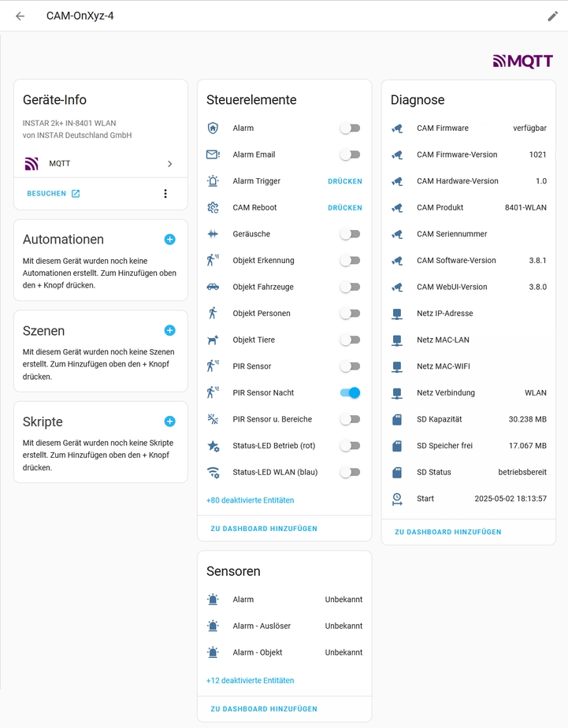
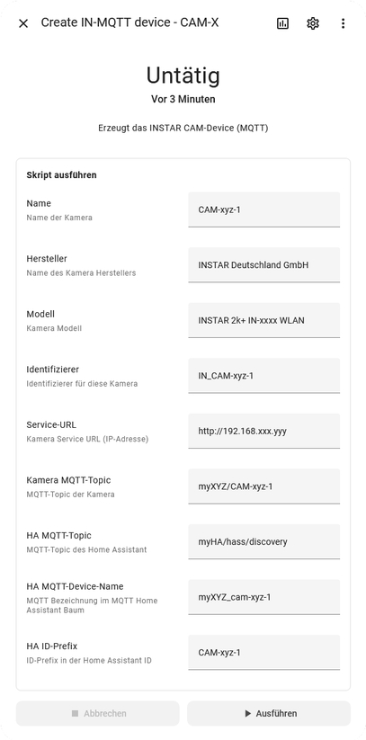
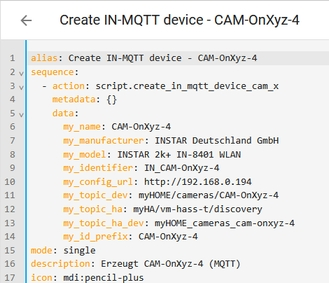
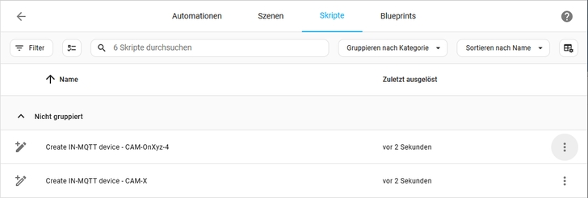
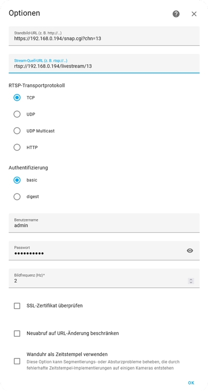
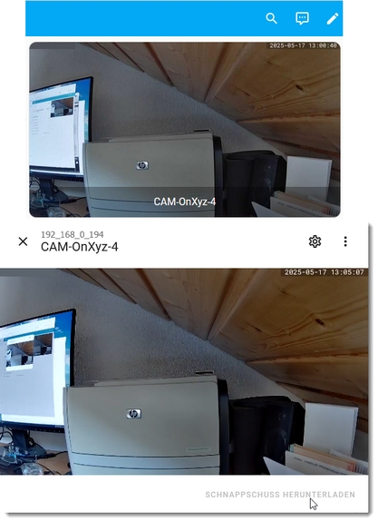

# WW-mySHT - Home Assistant - INSTAR 2K+ Kameras

[Zurück zur Übersicht ...](../README.md)

### Überblick
Zum derzeitigen Stand ('Home Assistant' - Version 2025.05 und 'INSTAR 2K+' - Firmware-Version 3.8.1) steht keine Integration für die 'INSTAR 2K+ Kameras' im 'Home Assistant' zur Verfügung. Jedoch gibt es im 'Home Assistant' eine umfangreiche Dokumentation zum Thema 'MQTT Auto-Discovery' - da die 'INSTAR 2K+ Kameras' über eine MQTT-Schnittstelle verfügen, lag es nahe, die MQTT-Topics der 'INSTAR 2K+ Kameras' im 'Home Assistant' abzubilden.

### Dokumentation
Sowohl im 'Home Assistant' Bereich, als auch im 'INSTAR' Bereich, gibt es umfangreiche Online-Dokumentationen. Folgende Links bilden die Know-How-Basis:

  - [Home Assistant - MQTT](https://www.home-assistant.io/integrations/mqtt)
  - [INSTAR - Für Entwickler - Steuern Sie Ihre Kamera direkt über ihre HTTP- oder MQTT-Schnittstelle](https://wiki.instar.com/de/Erweitert/)
  - [INSTAR - UltraHD Series (2K+ 1440p & 4K 2160p) CGI List](https://wiki.instar.com/en/1440p_Series_CGI_List/)

Weiterführende Skripte und Konfigurationen zum Thema kann man auch hier finden:

  - [Mike Polinowski - Home Assistant - MQTT Auto-Discovery :: Configuration](https://mpolinowski.github.io/docs/Automation_and_Robotics/Home_Automation/2022-07-10-home-assistant-mqtt-autodiscovery-part-i/2022-07-10)
  - [Mike Polinowski - Home Assistant - MQTT Auto-Discovery :: Automation](https://mpolinowski.github.io/docs/Automation_and_Robotics/Home_Automation/2022-07-11-home-assistant-mqtt-autodiscovery-part-ii/2022-07-11)

### Umsetzung
Der 'Home Assistant' präferiert die automatische Erkennung der angeschlossenen MQTT Geräte. Da die Firma 'INSTAR' eine 'Home Assistant' Integration beabsichtigt zu entwickeln, habe ich mich dazu entschlossen, einen etwas anderen Weg zu wählen, um schon jetzt die 'INSTAR 2K+ Kameras' im 'Home Assistant' verfügbar zu haben. Dafür wurde ein 'Home Assistant' Skript entwickelt, das ein 'INSTAR MQTT Gerät' generiert. Dabei wird die Mehrzahl der MQTT Topics der 'INSTAR 2K+ Kameras' abgebildet. Dieses Skript muss für eine Kamera nur einmal (manuell) ausgeführt werden.
<br><br>

<br><br>
Da mehrere 'INSTAR' Kameras integriert werden sollen, werden neun Eingabe-Parameter vorgegeben, die eine individuelle Bezeichnung und Konfiguration sicherstellen.
<br><br>

<br><br>
Um nicht immer wieder gleichartige Parameter-Eingaben manuell für jede Kamera eingeben zu müssen, kann man auch jeweils für jede Kamera ein eigenes Skript erstellen, das dann die spezifischen Kamera-Parameter an das Erzeugungsskript übergibt.
<br><br>

<br><br>

### Installation und Details
Zuerst wird das 'INSTAR MQTT Skripte' Archiv - [Stand 15.05.2025 - Download ...](./bin/HA_Script_Create_IN-MQTT_device_20250515.zip) geladen und entpackt. Folgende Text-Dateien sind enthalten:
  ```
    - Datei 'Script_Create IN-MQTT device - CAM-X - ALL.txt'
      Skript-Datei mit allen verfügbaren MQTT-Entitäten

    - Datei 'Script_Create IN-MQTT device - CAM-X - MIN.txt'
      Skript-Datei mit allen notwendigen MQTT-Entitäten

    - Datei 'Script_Create IN-MQTT device - CAM-X - MIN + Bild_Nacht.txt'
      zusätzliche MQTT-Entitäten (Bild-Parameter Nacht) für MIN-Datei
    - Datei 'Script_Create IN-MQTT device - CAM-X - MIN + Bild_Tag.txt'
      zusätzliche MQTT-Entitäten (Bild-Parameter Tag) für MIN-Datei
    - Datei 'Script_Create IN-MQTT device - CAM-X - MIN + Ptz.txt'
      zusätzliche MQTT-Entitäten (PTZ) für MIN-Datei

    - Datei 'Script_Create IN-MQTT device - CAM-OnXyz.txt'
      Beispiel Skript-Datei zum Aufruf von 'create_in_mqtt_device_cam_x'
  ```
Mit diesen Dateien kann individuell der Umfang der 'INSTAR' MQTT Entitäten den eigenen Bedürfnissen angepaßt werden. Am einfachsten ist es natürlich, im weiteren die Datei 'Script_Create IN-MQTT device - CAM-X - ALL.txt' zu benutzen und damit alle verfügbaren Entitäten zu generieren.

  - Im 'Home Assistant' unter '<i>Einstellungen / Automation & Szenen / Skripte</i>' ein neues Skript erstellt.
  - Dann wird der Bearbeitungsmodus auf '<i>In YAML bearbeiten</i>' (siehe 3 Punkte, rechts oben im Fenster) umgestellt. 
  - Es werden alle vorhandenen YAML Zeilen gelöscht.
  - Skript-Code aus 'Script_Create IN-MQTT device - CAM-X - ALL.txt' bzw. aus 'Script_Create IN-MQTT device - CAM-X - MIN.txt' in YAML-Editor kopieren
  - Skript speichern und Abfrage bestätigen.

Damit ist das zentrale Skript 'Create IN-MQTT device - CAM-X' zur Erzeugung eines 'INSTAR MQTT Gerätes' erstellt. Es kann direkt ausgeführt werden (siehe 3 Punkte / <i>Ausführen</i>). Alternativ kann auch für jede Kamera zusätzlich ein eigenes Skript angelegt werden, das die notwendigen Konfigurationsparameter enthält und dann an das zentrale Erzeugungsskript übergibt - siehe Beispiel-Datei 'Script_Create IN-MQTT device - CAM-OnXyz.txt'.
<br><br>

<br><br>
Die Konfigurationsparameter im Skript 'Create IN-MQTT device - CAM-X' bedeutetn im Einzelnen:

| Parameter | Bedeutung | Beispiel |
| --- | --- | --- |
| my_name | Home Assistant Name der Kamera | CAM-OnXyz-4 |
| my_manufacturer | Name des Kamera Herstellers | INSTAR Deutschland GmbH |
| my_model | Kamera Modell | INSTAR 2k+ IN-8401 WLAN |
| my_identifier | Identifizierer für diese Kamera | IN_CAM-OnXyz-4 |
| my_config_url | Kamera IP-Adresse | http://192.168.0.194 |
| my_topic_dev | MQTT-Topic der Kamera | myHOME/cameras/CAM-OnXyz-4 |
| my_topic_ha | MQTT-Discovery-Topic des Home Assistant | myHA/vm-hass-t/discovery |
| my_id_prefix | ID-Prefix in der Home Assistant ID | CAM-OnXyz-4 |

### Kamera-Bild 
Mit der derzeitigen 'Home Assistant' - Version 2025.05 hat es sich gezeigt, dass es für die Live-Bilddarstellung der 'INSTAR' Kameras am besten ist, nicht die 'ONVIF' Integration, sondern die Integration 'Generische Kamera' zu benutzen. Unter '<i>Einstellungen / Integrationen</i>' wird die Integration 'Generische Kamera' hinzuzugefügt. Dann können über '<i>Gerät hinzufügen</i>' die einzelnen 'INSTAR' Kameras per RTSP-Stream eingebunden werden. In der UI kann das Kamerabild angezeigt werden - es wird alle 10 Sekunden aktualisiert - mit einem Klick, kann das Live-Kamerabild in einem Popup aktiviert werden - optional kann ein Schnappschuß heruntergeladen werden.
<br><br>

<br><br>

<br><br>

### Historie
- 2025-05-16 - Erstveröffentlichung
