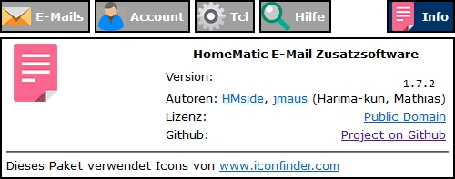
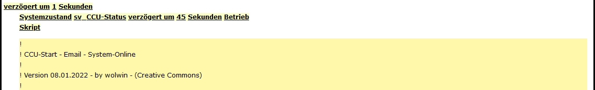

# WW-mySHT - 'RaspberryMatic' mit 'HM-Email-Addon' konfiguriert für den Versand von System-Meldungen

[Zurück zur Übersicht ...](../README.md)

### Funktion
Ausgangspunkt ist die 'RaspberryMatic' in der Release-Version 3.53.30 vom 24.01.2020 auf einem RPI3-System, auf dem die Installation und Konfiguration des 'HM-Email-Addon' in der Release-Version 1.7.2 vom 07.07.2021 vorgenommen wird.

Jeweils aktuelle 'RaspberryMatic' Versionen für unterschiedliche Hardwareplattformen finden sich hier:

- [Link 'RaspberryMatic'](https://github.com/jens-maus/RaspberryMatic/)
- [Link 'RaspberryMatic' Releases](https://github.com/jens-maus/RaspberryMatic/releases)

Das 'HM-Email-Addon' ist hier zu finden:

- [Link 'HM-Email-Addon'](https://github.com/homematic-community/hm_email)
- [Link 'HM-Email-Addon' Releases](https://github.com/homematic-community/hm_email/releases)

Ziel der Implementierung ist die nahtlose Integration von (unterschiedlichen) System-Meldungen der 'HomeMatic' auf Email-Basis. Mit Hilfe einer einheitlichen Strukturierung in der 'Email-Betreff-Zeile' soll die Möglichkeit geschaffen werden, eine automatische Filter-Sortierung der Meldungen auf der Empfänger-Mailbox zu erreichen.

### Details

Mit dem 'HM-Email-Addon' und seiner Templates lassen sich strukturierte System- und Fehler-Meldungen per Email versenden. Als Übergabeschnittstelle zwischen den (System-) Nachrichten und der 'HomeMatic' dienen Email-Systemvariablen, die von den 'HomeMatic'-Skripten gefüllt werden - folgende Systemvariablen müssen angelegt sein:

| Name | Beschreibung | Variablentyp
| --- | --- | --- |
| sv_EM-CC | Email - Empfänger-Kopie | Zeichenkette |
| sv_EM-SUBJ | Email - Betreff | Zeichenkette |
| sv_EM-SUBJ-PRE | Email - Betreff-Vorsatz | Werteliste |
||| ; |
||| [OK]; |
||| [INFO]; |
||| [HINWEIS]; |
||| [MELDUNG]; |
||| [ERFOLG]; |
||| [WARNUNG]; |
||| [FEHLER]; |
||| [SYSTEM]; |
||| [SYSTEM-FEHLER]; |
||| [DATA]; |
||| ### WARNUNG ###; |
||| ### FEHLER ###; |
||| ### SYSTEM ###; |
||| ### SYSTEM-FEHLER ###; |
||| ### USV ###; |
||| ### NUT-USV ### |
| sv_EM-TEXT | Email - Text | Zeichenkette |
| sv_EM-TO | Email - Empfänger | Zeichenkette |

Für die Email-Templates müssen zur Identifkation der 'RaspberryMatic' noch die folgenden Systemvariablen angelegt:

| Name | Beschreibung | Variablentyp
| --- | --- | --- |
| sv_CCU-Status | CCU - Boot-Betrieb-Flag	| Logikwert |
| | | wahr = Booten |
| | | falsch = Betrieb |
| sv_CCU-IP | CCU - IP-Adresse | Zeichenkette |
| sv_CCU-HOST | CCU - Hostname | Zeichenkette |

### Installation

Die Installation des 'HM-Email-Addon' wird wie üblich über die WebUI unter '*Startseite -> Einstellungen -> Systemsteuerung -> Zusatzsoftware*' durchgeführt. Nach dem System-Neustart wird das Addon unter '*Startseite -> Einstellungen -> Systemsteuerung -> Email*' konfiguriert.



Zuerst wird die Mailbox-Adresse (hier: 'xxxhome@web.de') in das 'Template 01' eingegeben und mit 'Übernehmen' gespeichert:


Dann werden die Anmeldedaten für das Mailbox-Konto eingegeben - im Beispiel sind die Verbindungsdaten für ein fiktives 'WEB.DE' Email-Konto eingetragen worden. Für andere Email-Provider sind die Angaben entsprechend anzupassen. Mit 'Übernehmen' werden die Verbindungsdaten gespeichert:


Über den 'Testmail senden' Button unter dem Reiter 'Hilfe' kann dann getestet werden, ob alle Verbindungseinstellungen korrekt vorgenommen worden sind:


Unter dem Reiter 'Tcl' wird das folgende Tcl-Skript eingefügt, mit dem die Inhalte der 'HomeMatic' Systemvariablen ind die Email-Vorlagen kopiert werden:

- [HM-Email - Tcl-Skript](./bin/email_tcl.txt)

  

Als nächstes werden die Email-Vorlagen als Templates erstellt:

- [HM-Email - Templates](./bin/email_templates.txt)

- Email-Templates für das Herunterfahren und das Starten des Systems:

  

  

  

  

- Universielle Email-Templates, deren Inhalte über die jeweilig benutzten Systemvariablen gesteuert werden:

  

  

  

  

Damit ist die Grundinstallation des 'HM-Email-Addon' erfolgreich abgeschlossen worden.

### 'HM-Email-Addon' - CCU Benachtigungsfunktionen

Um die 'Start'- und 'Herunterfahren'-Aktionen der 'RaspberryMatic' per Email-Benachrichtigung zu erhalten, sind folgende Skripte notwendig:

- 'Start'-Skript der CCU - Quelltext: [sys_CCU-Start](../bin/hm_sys_ccu_start.txt)

  

  

  

- 'Herunterfahren'-Prozess der 'RaspberryMatic' - Quelltext: [usr_startstop](../bin/hm_usr_startstop.txt)

    -	Einfügen der Datei */usr/local/etc/config/rc.d/usr_startstop* mit 'WinSCP'
      - Datei 'usr_startstop' anlegen
      - Datei-Rechte auf '0x0755' – 'root[0]' setzen


- Beispiel: Email-Versand für das Herunterfahren und Neustarten der 'RaspberryMatic'

  

  

  

  


### 'HM-Email-Addon' Erweiterung für Version 1.7.2

##### - Erweiterung: 'HomeMatic' Alarm-Meldung, wenn ein Email-Fehler auftritt

- <b>!!! Achtung: bei einem 'HM-Email-Addon' Update werden diese Änderung überschrieben !!!*</b>

- in */usr/local/etc/config/addons/email/email* mit 'WinSCP' editieren:
  - nach Zeile 290: 'exec -- logger -t email -p user.err $errMsg' einfügen:
    ```
    exec /bin/triggerAlarm.tcl "$errMsg" "Email-Alarm"
    ```
    


- in */usr/local/etc/config/addons/email/email_cuxd* mit 'WinSCP' editieren:
  - nach Zeile 215: 'exec -- logger -t email -p user.err $errMsg' einfügen:
    ```
    exec /bin/triggerAlarm.tcl "$errMsg" "Email-Alarm"
    ```
    


- Beispiel:

  


### Historie
- 2022-04-19 - Erstveröffentlichung
