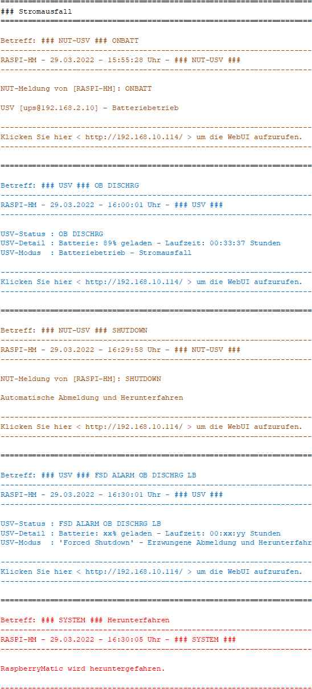
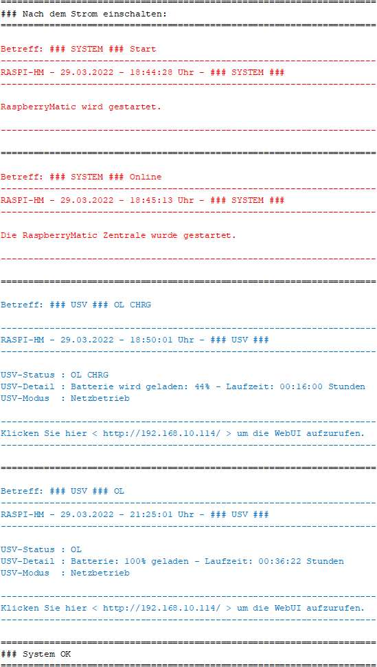

# WW-mySHT - Einbinden einer USV in die 'RaspberryMatic' mit den 'Network UPS Tools'

[Zurück zur Übersicht ...](../README.md)

- Weiter zu: [II.) 'RaspberryMatic' als 'NUT-Client' konfigurieren ...](./RM-NUT_Client.md)

- Weiter zu: [III.) 'RaspberryMatic' als 'NUT-Server' konfigurieren ...](./RM-NUT_Server.md)

- Weiter zu: [IV.) 'RaspberryMatic' Erweiterungen der 'NUT' Konfiguration (Client und Server) ...](./RM-NUT_Xtend.md)

- Weiter zu: [V.) 'RaspberryMatic' und 'NUT' Monitoring (Client und Server) ...](./RM-NUT_HM-Mon.md)

### I.) 'RaspberryMatic' und 'Network UPS Tools'
Ausgangspunkt ist die 'RaspberryMatic' in der Release-Version 3.53.30 vom 24.01.2020 auf einem RPI3-System, auf dem eine 'NUT-Client' bzw. eine 'NUT-Server' Installation mit einer 'APC Back-UPS CS 650' vorgenommen wird. Jeweils aktuelle 'RaspberryMatic' Versionen für unterschiedliche Hardwareplattformen finden sich hier:

- [Link 'RaspberryMatic'](https://github.com/jens-maus/RaspberryMatic/)
- [Link 'RaspberryMatic' Releases](https://github.com/jens-maus/RaspberryMatic/releases)

Ziel der Implementierung ist die nahtlose Integration der 'Network UPS Tools' im 'HomeMatic' Umfeld, vom Email-Versand bei Stromverlust bis hin zur Darstellung der aktuellen USV-Werte.

### Details
Die 'RaspberryMatic' beinhaltet die ['Network UPS Tools' (NUT) - Power Devices support](http://networkupstools.org/). 'NUT' ist ein Client-/Server-Framework zur Ansteuerung und Verwaltung einer unterbrechungsfreien Stromversorgung (englisch: 'Uninterruptible Power Supply' -> UPS). Unterstützt werden [über 100 verschiedene Hersteller und Modelle](https://networkupstools.org/stable-hcl.html).

Die Kernprogrammkomponenten arbeiten als Systemdienste (Daemon), d.h. diese werden automatisch beim Einschalten des Rechners gestartet und arbeiten dann im Hintergrund. 'NUT' kann dabei beim heimischen PC ebenso eingesetzt werden, wie bei einzelnen Servern oder bis hin zu umfangreichen Konstellationen, welche aus mehreren Servern und mehreren USVen bestehen.

Eine detaillierte Erläuterung (englisch) zur 'NUT' Konfiguration findet sich in dem äußerst empfehlenswerten PDF-Dokuments von Roger Price:

['NUT - Introduction to Network UPS Tools - Conguration Examples'](http://rogerprice.org/NUT/ConfigExamples.A5.pdf)

### Ablauf und Systematik bei einem Stromausfall unter Verwendung der 'Network UPS Tools'

- <b> Ausfall der Hauptstromversorgung tritt auf:</b>
  - Das USV-Gerät schaltet die Stromversorgung automatisch auf Batteriebetrieb um.
  - Das USV-Gerät benachrichtigt den 'NUT-Server' mit einer 'On Battery'-Ereignismeldung.
  - Der 'NUT-Server' wiederum benachrichtigt die 'NUT-Clients' mit einer 'On Battery'-Ereignismeldung.

- <b> Der Ausfall der Hauptstromversorgung hält an und die UPS-Batterie ist fast leer:</b>
  - Das USV-Gerät benachrichtigt den 'NUT-Server' mit einer 'Battery Low'-Ereignismeldung.
  - Der 'NUT-Server' gibt die Befehlsnachricht 'Forced Shutdown' an alle 'NUT-Clients' aus.
  - Der 'NUT-Server' gibt 'Remote-Shutdown'-Befehle per SSH an alle nicht verwalteten Geräte aus.
  - Nicht verwaltete Geräte beginnen mit dem Herunterfahren.
  - 'NUT-Clients' erhalten die Kommandomeldung 'Forced Shutdown'.
  - 'NUT-Clients' können eine 'Shutdown' Benachrichtigungsnachricht an ihre Benutzer ausgeben.
  - 'NUT-Clients' warten die eingestellte 'Final Delay'-Zeit. Dies dient der Verarbeitung der oben genannten Benachrichtigungen.
  - 'NUT-Clients' benachrichtigen den NUT-Server mit einer 'Notify Shutdown'-Ereignismeldung.
  - 'NUT-Clients' starten ihre Shutdown-Prozedur:
    - Beendet alle laufenden Prozesse.
    - Unmountet alle Dateisysteme.
    - Remountet Dateisysteme als schreibgeschützt.
    - Hält das System an (aber schaltet sich nicht aus).
  - Der 'NUT-Server' wartet, bis er von allen 'NUT-Clients' Ereignismeldungen 'Notify Shutdown' erhalten hat.
  - Der 'NUT-Server' gibt eine 'Shutdown' Benachrichtigung an seine Benutzer aus.
  - Der 'NUT-Server' wartet die eingestellte 'Final Delay'-Zeit. Dies dient der Verarbeitung der oben genannten Benachrichtigungen.
  - Der 'NUT-Server' startet seine Shutdown-Prozedur:
    - Setzt das 'Killpower'-Flag
    - Beendet alle laufenden Prozesse.
    - Unmountet alle Dateisysteme.
    - Remountet Dateisysteme als schreibgeschützt.
    - Sucht nach dem 'Killpower'-Flag.
    - Gibt den 'Kill Power'-Befehl an das USV-Gerät aus.
    - Hält das System an (aber schaltet sich nicht aus).
  - Das USV-Gerät erhält den 'Kill Power'-Befehl vom 'NUT-Server':
    - Die USV wartet, bis die 'Shutdown Delay'-Zeit verstrichen ist. Dies soll allen Systemen genügend Zeit geben, um ordnungsgemäß herunterzufahren.
    - Das USV-Gerät unterbricht die Stromversorgung an allen USV-Steckdosen.
  - Alle an die USV angeschlossenen Systeme werden vom Strom getrennt.

- <b>	Die Hauptstromversorgung wurde wiederhergestellt</b>
  - Das USV-Gerät beginnt, seine Batterie nachzuladen.
  - Das USV-Gerät wartet auf den Ablauf der 'Startup Delay'-Zeit. Dies dient dazu, die Batterie auf ein sicheres Mindestniveau aufzuladen.
  - Das USV-Gerät stellt die Stromversorgung an allen USV-Steckdosen wieder her.
  - Alle angeschlossenen Systeme starten.

### Konfiguration der 'Network UPS Tools' für die 'RaspberryMatic'

Per Default ist 'NUT' auf der 'RaspberryMatic' deaktiviert. Über verschiedene Text-Konfigurationsdateien kann die 'RaspberryMatic' mit Hilfe der SSH-Konsole als 'NUT-Client' oder als 'NUT-Server' konfiguriert werden. Dazu muss zuerst die SSH-Konsole in der WebUI der 'RaspberryMatic' aktiviert werden (*'Systemsteuerung -> Sicherheit -> SSH'*). Mit dem Windows Programm 'WinSCP' kann dann mit dem User 'root' die SSH-Verbindung zur 'RaspberryMatic' hergestellt werden und die Änderungen vorgenommen werden.
Außerdem muss die Firewall für den Port 3493 freigegeben werden (*'Systemsteuerung -> Firewall konfigurieren -> Portfreigabe'*).
Die 'NUT'- Binär- und Konfigurationsdateien liegen bei der 'RaspberryMatic' an einem anderen Ort als bei z.B. einer 'DEBIAN'-Installation:

  | | Debian | RaspberryMatic |
  | --- | --- | --- |
  | Binär |	/lib/nut/ | /usr/sbin/ |
  | Konfiguration | /etc/nut/ | /usr/local/etc/config/nut/ |

### Beispiel-Szenario 'RaspberryMatic' und 'Network UPS Tools' bei Stromausfall

In diesem Email-Verlauf Beispiel eines Stromausfalls werden alle hier vorgestellten Konfigurationen gemeinsam genutzt. Dabei greifen mehrere Skripte ineinander:

- Kennzeichnung:
  - In *ROT*: 'HomeMatic' Skripte, die beim Hoch- und Herunterfahren der 'RaspberryMatic' ausgeführt werden (Betreff: ### SYSTEM ###).
  - In *BRAUN*: 'NUT' Skripte, die bei 'NUT-Events' ausgeführt werden (Betreff: ### NUT-USV ###)
  - In *BLAU*: 'HomeMatic' Skripte, die auf 'NUT-Server' Monitor Änderungen reagieren (Betreff: ### USV ###).

- Bei Stromausfall:

  

- Bei Stromwiederkehr:

  

### Historie
- 2022-04-18 - Erstveröffentlichung
