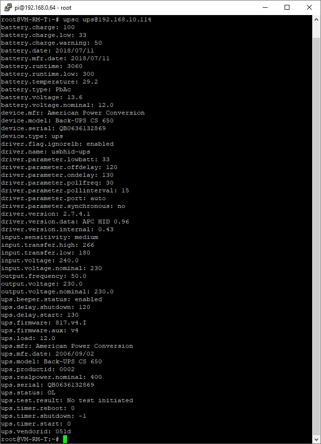

# WW-mySHT - Einbinden einer USV in die 'RaspberryMatic' mit den 'Network UPS Tools' - Client-Installation

[Zurück zur Übersicht ...](../README.md)

- Weiter zu: [I.) 'RaspberryMatic' und 'Network UPS Tools' ...](./README.md)

- Weiter zu: [III.) 'RaspberryMatic' als 'NUT-Server' konfigurieren ...](./RM-NUT_Server.md)

- Weiter zu: [IV.) 'RaspberryMatic' Erweiterungen der 'NUT' Konfiguration (Client und Server) ...](./RM-NUT_Xtend.md)

- Weiter zu: [V.) 'RaspberryMatic' und 'NUT' Monitoring (Client und Server) ...](./RM-NUT_HM-Mon.md)

### II.) 'RaspberryMatic' als 'NUT-Client' konfigurieren

Ist die 'RaspberryMatic' mit ihrer Stromversorgung an eine USV angeschlossen, die von einem 'NUT-Server' gemanagt wird, dann wird die 'RaspberryMatic' als 'NUT-Client' konfiguriert. Die Konfigurationsdateien können mit 'WinSCP' editiert werden.

##### nut.conf
Diese Datei teilt den 'Network UPS Tools' mit, in welchem Modus sie ausgeführt werden sollen. Abhängig von dieser Einstellung werden dann die benötigten Module gestartet. Es wird eingetragen, dass es sich um einen 'NUT-Client' handelt:
-	Anpassen der Datei */etc/config/nut/nut.conf*
  - Eintrag 'MODE=none' ändern in:
    ```
    MODE=netclient
    ```

##### upsmon.conf
Die Hauptaufgabe dieser Datei besteht darin, die Systeme zu definieren, die 'upsmon' überwacht, und 'NUT' mitzuteilen, wie das System bei Bedarf heruntergefahren werden soll. Hier wird die Verbindung zum 'NUT-Server' eingetragen.
-	Anpassen der Datei */etc/config/nut/upsmon.conf*
  - Eintrag '# MONITOR ups@bigserver 1 <USERNAME> <PASSWORD> slave' ändern in:
    ```
    MONITOR <UPSNAME>@<IP-ADRESS> 1 <USERNAME> <PASSWORD> slave
    ```
    |||
    | --- | --- |
    | \<UPSNAME\> | Name des UPS-Devices des 'NUT-Servers' (z.B.: ups) |
    | \<IP-ADRESS\> | IP-Adresse des 'NUT-Servers' (z.B.: 192.168.10.114) |
    | \<USERNAME\> | 'NUT-Client' Nutzername (z.B.: monuser) |
    | \<PASSWORD\> | Passwort (z.B.: pass) |

  - Beispiel:
    ```
    MONITOR ups@192.168.10.114 1 monuser pass slave
    ```

  - <u>Anmerkung</u>: für die Verbindung zu einem ein Synology NAS muss immer <USERNAME> 'monuser' und <PASSWORD> 'secret' verwendet werden (d.h. es muss kein NAS Nutzer angelegt werden).

##### nut_notify.sh
In der Datei 'upsmon.conf' wird mit der Zeile 'NOTIFYCMD /etc/config/nut/nut_notify.sh' festgelegt, dass das 'nut_notify.sh' Skript aufgerufen wird, sobald 'NUT' ein angeschlossenes USV-System identifiziert, das Aufmerksamkeit erfordert. Mit diesem Skript wird eine Alarm-Meldung an die 'RaspberryMatic' geschickt:

```
# trigger a HomeMatic alarm message to "${UPSNAME}-Alarm"
/bin/triggerAlarm.tcl "${NOTIFYTYPE}" "${UPSNAME}-Alarm"
```

##### upsd.conf
Diese Datei kontrolliert den Zugriff auf den 'NUT-Server' (hier: über IP-Adresse) – es können verschiedene Verbindungskonfigurationswerte gesetzt werden (siehe # Kommentare):

  -	Anpassen der Datei /etc/config/nut/upsd.conf
    -	Nach der letzten Kommentarzeile einfügen:
          ```
          LISTEN <IP-ADRESS> 3493
          ```
          |||
          | --- | --- |
          | \<IP-ADRESS\> |	IP-Adresse des 'NUT-Servers' (z.B.: 192.168.10.114) |

    - Beispiel:
      ```
      LISTEN 192.168.10.114 3493
      ```

##### upsd.users
'NUT' Verwaltungsbefehle wie das Festlegen von Variablen oder die Sofortbefehle sind systemrelevant – daher muss der Zugriff darauf eingeschränkt werden. Diese Datei definiert, wer darauf zugreifen darf und was verfügbar ist.

Jeder Benutzer bekommt seinen eigenen Abschnitt. Die Felder in diesem Abschnitt legen die Parameter fest, die den Berechtigungen dieses Benutzers zugeordnet sind. Der Abschnitt beginnt mit dem Namen des Benutzers in Klammern und wird bis zum nächsten Benutzernamen in Klammern oder EOF fortgesetzt. Diese Benutzer sind unabhängig von den Benutzer in '/etc/passwd'.

  -	Anpassen der Datei */etc/config/nut/upsd.users*
    -	Nach der letzten Kommentarzeile einfügen:
          ```
          [<USERNAME-S>]
          password = <PASSWORD-S>
          upsmon slave
          ```    
          |||
          | --- | --- |
          | \<USERNAME-S\> |	'NUT-Client' Nutzername (z.B.: monuser) |
          | \<PASSWORD-S\> |	Passwort (z.B.: pass) |

      - Beispiel:
        ```
        [monuser]
        password = pass
        upsmon slave
        ```

##### upssched.conf
Siehe unter: ['RaspberryMatic' als 'NUT-Server' konfigurieren – 'upssched.conf'](./RM-NUT_Server.md#upsschedconf)

##### nut_schedule.sh
Siehe unter: ['RaspberryMatic' als 'NUT-Server' konfigurieren – 'nut_schedule.sh'](./RM-NUT_Server.md#nut_schedulesh)

##### Abschluß Konfiguration 'NUT-Client'
Nach der Konfiguration die 'RaspberryMatic' per WebUI neu starten oder den 'NUT' Dienst mittels SSH und folgendem Kommando neustarten:
```
/etc/init.d/S51nut restart
```
Danach sollte der 'NUT' Daemon 'upsmon' laufen - die USV entsprechend überwachen und dann bei Ausfall des Stroms als Erstes eine Alarmmeldung innerhalb des HomeMatic-Systems generieren und bei zu langem Ausfall die RaspberryMatic automatisch geordnet herunterfahren.

  - Mit Hilfe der SSH-Konsole des 'NUT-Clients' kann man sich auch alle aktuellen Werte der USV des 'NUT-Servers' ausgeben lassen:
    ```
    upsc <UPSNAME>@<IP-ADRESS>
    ```
    |||
    | --- | --- |
    | \<UPSNAME\> |	Name des UPS-Devices des 'NUT-Servers' (z.B.: ups) |
    | \<IP-ADRESS\> | IP-Adresse des 'NUT-Servers' (z.B.: 192.168.10.114) |

    - Beispiel:
      ```
      upsc ups@192.168.10.114
      ```

      

### Setup 'RaspberryMatic' als 'NUT-Client'

- Weiter zu: ['RaspberryMatic' - 'NUT-Client' - vollständige Konfigurationsdateien ...](./bin/RM_NUT_Client)

- Weiter zu: ['RaspberryMatic' - 'NUT'-Konfigurationsdateien (original) ...](./bin/RM_NUT_3.53.30)

### Historie
- 2022-04-18 - Erstveröffentlichung
