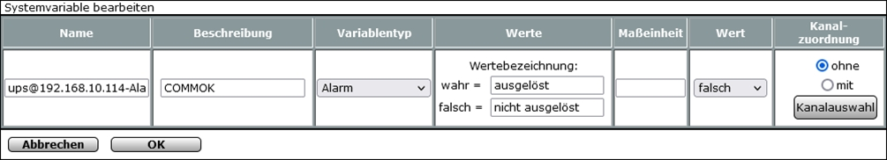
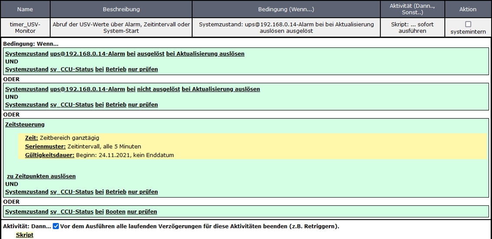
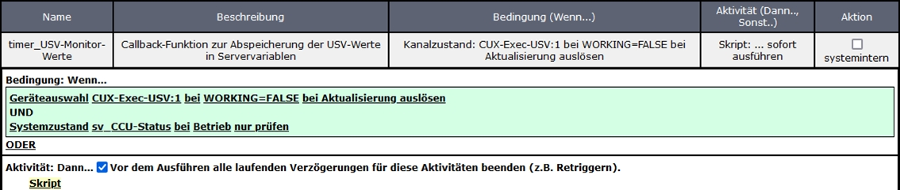
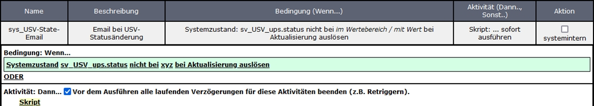
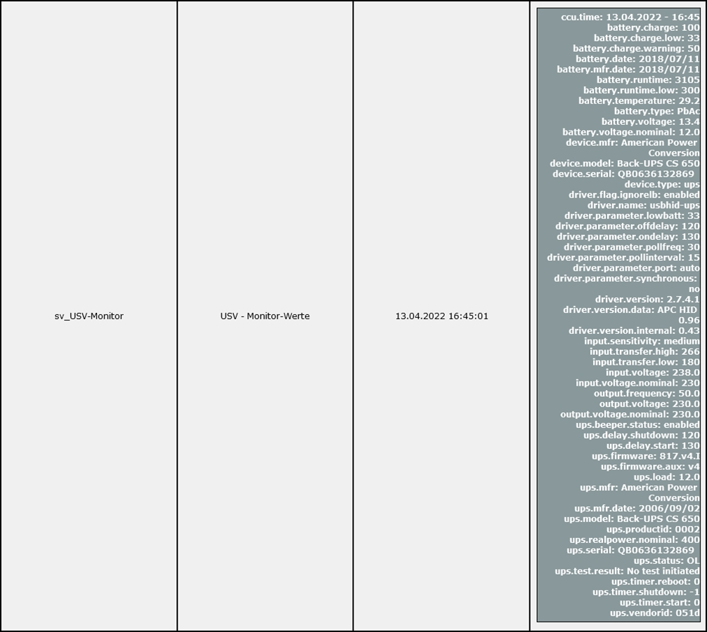
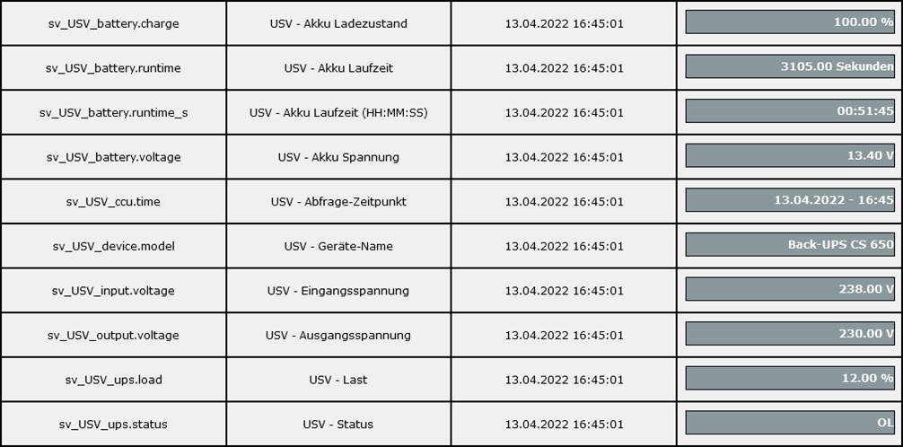
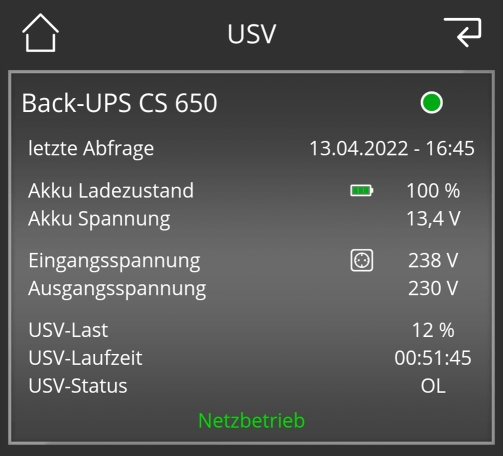

# WW-mySHT - Einbinden einer USV in die 'RaspberryMatic' mit den 'Network UPS Tools' - 'NUT' Monitoring

[Zurück zur Übersicht ...](../README.md)

- Weiter zu: [I.) 'RaspberryMatic' und 'Network UPS Tools' ...](./README.md)

- Weiter zu: [II.) 'RaspberryMatic' als 'NUT-Client' konfigurieren ...](./RM-NUT_Client.md)

- Weiter zu: [III.) 'RaspberryMatic' als 'NUT-Server' konfigurieren ...](./RM-NUT_Server.md)

- Weiter zu: [IV.) 'RaspberryMatic' Erweiterungen der 'NUT' Konfiguration (Client und Server) ...](./RM-NUT_Xtend.md)

### 'RaspberryMatic' und 'NUT' Monitoring (Client und Server)

Wie in den vorherigen Kapiteln gezeigt, kann der 'NUT-Server' so konfiguriert werden, dass er eigenständig 'NUT'-Systemmeldungen u.a. als Email versenden kann (siehe 'nut_notify.sh' und / oder 'upssched.conf'). Es ist aber gewünscht, die 'NUT'-Events und -Informationen innerhalb der 'HomeMatic' zu benutzen.

Das im Folgenden beschriebene Verfahren funktioniert auf der 'RaspberryMatic' sowohl für eine 'NUT-Server', als auch eine 'NUT-Client' Installation. Voraussetzung ist die Installation des 'CUxD Addons' mit dem Exec-Device 'CUxD.CUX2801001'.

Als Schnittstelle zum 'NUT-Server' wird der 'upsc \<UPSNAME\>@\<IP-ADRESS\>' Befehl benutzt, der zeitgesteuert alle 5 Minuten aufgerufen wird. Gleichzeitig wird der Alarm von '\<UPSNAME\>@\<IP-ADRESS\>' überwacht, um direkt auf 'NUT'-Events reagieren zu können.

- Zuerst muss eine 'HomeMatic' Systemvariable für den UPS-Alarm angelegt werden. Diese wird zwar automatisch bei der ersten 'NUT'-Meldung erzeugt – siehe auch Deklaration in 'nut_notify.sh' - sie wird aber für die Programmierung in der WebUI vorab benötigt:

  ```
  <UPSNAME>@<IP-ADRESS>-Alarm
  ```
  |||
  | --- | --- |
  | \<UPSNAME\> |	Name des UPS-Devices des 'NUT-Servers' (z.B.: ups) |
  | \<IP-ADRESS\> | IP-Adresse des 'NUT-Servers' (z.B.: 192.168.10.114) |

  - Beispiel:
    ```
    ups@192.168.10.114-Alarm
    ```

    

- Das 'HomeMatic' Programm 'timer_USV-Monitor' anlegen

  

  Quelltext: [timer_USV_Monitor ...](./bin/RM_NUT_HM/timer_USV-Monitor.txt)

- Das 'HomeMatic' Programm 'timer_USV-Monitor-Werte' anlegen

  

  Quelltext: [timer_USV_Monitor-Werte ...](./bin/RM_NUT_HM/timer_USV-Monitor-Werte.txt)

- Das 'HomeMatic' Programm 'sys_USV-State-Email' anlegen

  

  Quelltext: [sys_USV-State-Email ...](./bin/RM_NUT_HM/sys_USV-State-Email.txt)

- 'HomeMatic' Systemvariable 'sv_USV-Monitor' nach einer 'NUT'-Abfrage

  

- 'HomeMatic' Systemvariablen 'sv_USV-xxx' (Detail) nach einer 'NUT'-Abfrage

  

- Handy-Darstellung der 'HomeMatic' Systemvariablen in 'Mediola AIO CREATOR NEO'

  


### Historie
- 2022-04-18 - Erstveröffentlichung
