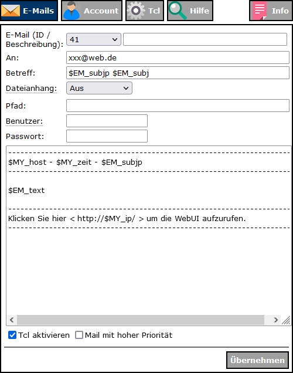

# WW-mySHT - Einbinden einer USV in die 'RaspberryMatic' mit den 'Network UPS Tools' - 'RaspberryMatic'-Erweiterungen

[Zurück zur Übersicht ...](../README.md)

- Weiter zu: [I.) 'RaspberryMatic' und 'Network UPS Tools' ...](./README.md)

- Weiter zu: [II.) 'RaspberryMatic' als 'NUT-Client' konfigurieren ...](./RM-NUT_Client.md)

- Weiter zu: [III.) 'RaspberryMatic' als 'NUT-Server' konfigurieren ...](./RM-NUT_Server.md)

- Weiter zu: [V.) 'RaspberryMatic' und 'NUT' Monitoring (Client und Server) ...](./RM-NUT_HM-Mon.md)

### IV.) 'RaspberryMatic' Erweiterungen der 'NUT' Konfiguration (Client und Server)

Gerade im Bereich des 'Power Managements' macht es Sinn, Überblick über den Verlauf eines Stromausfalls zu haben. Als Ansatz wurde für die 'RaspberryMatic' der Versand per Email gewählt. Mit Hilfe des ['HM-Email-Addon'](https://github.com/homematic-community/hm_email) und seiner Templates lassen sich strukturierte System- und Fehler-Meldungen per Email versenden. Eine ausführliche Installation- und Konfiguration-Anleitung findet sich hier:

- ['RaspberryMatic' mit 'HM-Email-Addon' konfiguriert für den Versand von System-Meldungen](../SHT_RM_Email/README.md)

Mit Hilfe des TCL-Skripts 'Msg2Var.tcl' können die 'HomeMatic' Systemvariablen für den Email-Versand gefüllt werden. In diesem Zusammenspiel von 'Email-Addon' und 'NUT'-Skripten kann der Statusverlauf der 'RaspberryMatic' und der USV dokumentiert werden.

#### Msg2Var.tcl
Das TCL-Skript 'Msg2Var.tcl' kann den 'state' (Wert) von 'HomeMatic' Systemvariablen beschreiben.

  -	Einfügen der Datei */etc/config/nut/Msg2Var.tcl*&nbsp;&nbsp;&nbsp;([Konfiguration-Pfad 'RaspberryMatic' ...](./README.md#konfiguration-der-network-ups-tools-f%C3%BCr-die-raspberrymatic))
    - Datei 'Msg2Var.tcl' mit folgendem Inhalt anlegen:
    - Datei-Rechte auf '0x0755' – 'root[0]' setzen

      ```
      #!/bin/tclsh

      # Simple tclsh script to write state to an <internal> variable.
      #
      # Usage:
      # Msg2Var.tcl <msg> <var>
      #
      # <msg> = message text
      # <var> = system variable name
      #
      # Return 0 – success
      #        1 – error

      load tclrpc.so
      load tclrega.so

      if { $argc != 2 } {
        puts "ERROR: Msg2Var [msg] [var] - script requires two arguments"
        exit 1
      }

      set msg [lindex $argv 0]
      set var [lindex $argv 1]

        set script "
          object alObj = null;
          string sSysVarId;
          foreach(sSysVarId, dom.GetObject(ID_SYSTEM_VARIABLES).EnumIDs()) {
            object oSysVar = dom.GetObject(sSysVarId);
            if(oSysVar.Name() == \"$var\") {
              alObj=oSysVar;
              break;
            }
          }
        "

      append script "

        if(alObj != null) {
          alObj.State(\"$msg\");
        }
      "  

      if { ![catch {array set result [rega_script $script]}] } then {
        if { $result(alObj) != "null" } {
          set res 0
        } else {
          set res 1
        }
      } else {
        set res 1
      }

      exit $res
      ```

#### upsmon.conf
*Erweiterung*: für den 'NUT-Client' und den 'NUT-Server' werden 'NOTIFYMSG' Zeilen eingefügt, die dann bei entsprechenden Events das 'nut_notify.sh' Skript aufrufen:

  -	Anpassen der Datei */etc/config/nut/upsmon.conf*&nbsp;&nbsp;&nbsp;([Konfiguration-Pfad 'RaspberryMatic' ...](./README.md#konfiguration-der-network-ups-tools-f%C3%BCr-die-raspberrymatic))

       ```
       ...
       NOTIFYCMD /etc/config/nut/nut_notify.sh

       NOTIFYMSG ONLINE      "USV [%s] - Netzbetrieb"
       NOTIFYMSG ONBATT      "USV [%s] - Batteriebetrieb"
       NOTIFYMSG LOWBATT     "USV [%s] - schwache Batterie"
       NOTIFYMSG FSD         "USV [%s] - erzwungenes Herunterfahren wird ausgefuehrt"
       NOTIFYMSG COMMOK      "USV [%s] - Verbindung mit der USV wieder hergestellt"
       NOTIFYMSG COMMBAD     "USV [%s] - Verbindung mit der USV verloren"
       NOTIFYMSG SHUTDOWN    "Automatische Abmeldung und Herunterfahren"
       NOTIFYMSG REPLBATT    "USV [%s] - Batterie muss ersetzt werden"
       NOTIFYMSG NOCOMM      "USV [%s] - ist nicht verfuegbar"
       NOTIFYMSG NOPARENT    "upsmon Elternprozess fehlt - Herunterfahren nicht moeglich"

       NOTIFYFLAG ONLINE   SYSLOG+EXEC
       ...
       ```

#### nut_notify.sh
*Erweiterung*: für den 'NUT-Client' und den 'NUT-Server' werden die 'HomeMatic' Email-Systemvariablen gesetzt (16 => '### NUT-USV ###') und dann der Email-Versand für das Email-Template '41'  durchgeführt.

  -	Anpassen der Datei */etc/config/nut/nut_notify.sh*&nbsp;&nbsp;&nbsp;([Konfiguration-Pfad 'RaspberryMatic' ...](./README.md#konfiguration-der-network-ups-tools-f%C3%BCr-die-raspberrymatic))

       ```
       #!/bin/sh
       #
       # This script will be called as soon as NUT identifies a
       # connected UPS system to require some attention.
       #
       # You can adapt this to your needs and use ${UPSNAME} and
       # ${NOTIFYTYPE} which will be set by NUT.
       #

       myMsg=$*
       myMsg="NUT-Meldung von [`hostname`]: ${NOTIFYTYPE}\n\n${myMsg}"

       # trigger a HomeMatic alarm message to "${UPSNAME}-Alarm"
       /bin/triggerAlarm.tcl "${NOTIFYTYPE}" "${UPSNAME}-Alarm"

       # trigger an email alarm message via template
       SCRIPTPATH=$(cd `dirname $0` && pwd)
       "$SCRIPTPATH/Msg2Var.tcl" "16" "sv_EM-SUBJ-PRE"
       "$SCRIPTPATH/Msg2Var.tcl" "${NOTIFYTYPE}" "sv_EM-SUBJ"
       "$SCRIPTPATH/Msg2Var.tcl" "${myMsg}" "sv_EM-TEXT"
       "/etc/config/addons/email/email" "41"
       ```  

#### 'HM-Email-Addon' - 'NUT'-Template

Snapshot des 'NUT' Email-Template ...



... mit den folgenden Tcl-Einstellungen:

  ```
  load tclrega.so

  array set values [rega_script {
  var em_to = dom.GetObject("sv_EM-TO").Value();
  var em_subjp = web.webGetValueFromList(dom.GetObject("sv_EM-SUBJ-PRE").ValueList(),dom.GetObject("sv_EM-SUBJ-PRE").Value());
  var em_subj = dom.GetObject("sv_EM-SUBJ").Value();
  var em_text = dom.GetObject("sv_EM-TEXT").Value();
  var my_ip = dom.GetObject("sv_CCU-IP").Value();
  var my_host = dom.GetObject("sv_CCU-HOST").Value();
  string my_zeit = system.Date("%d.%m.%Y - %H:%M:%S Uhr");
  } ]

  set EM_to $values(em_to)
  set EM_subjp $values(em_subjp)
  set EM_subj [encoding convertfrom utf-8 $values(em_subj)]
  set EM_text [encoding convertfrom utf-8 $values(em_text)]

  set MY_zeit $values(my_zeit)
  set MY_ip $values(my_ip)
  set MY_host $values(my_host)
  ```  

- Details finden sich hier: ['RaspberryMatic' mit 'HM-Email-Addon' konfiguriert für den Versand von System-Meldungen](../SHT_RM_Email/README.md)

### Historie
- 2022-08-08 - 'RaspberryMatic' Konfigurations-Pfad eingepflegt
- 2022-04-18 - Erstveröffentlichung
