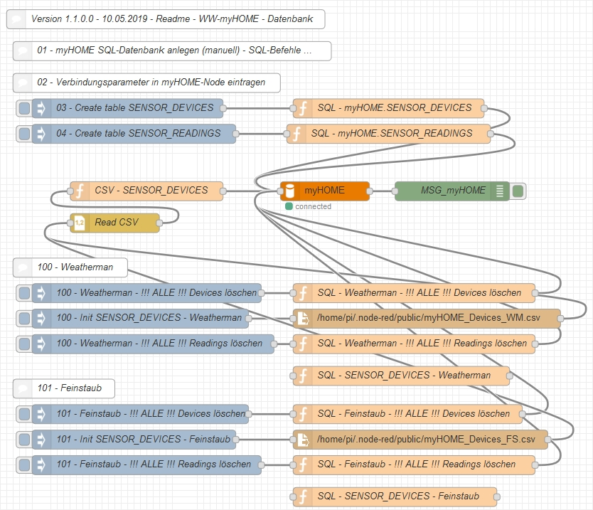

# WW-mySHT - Sensor-Datenbank

[Zurück zur Übersicht ...](../README.md)

### Funktion

Erstellen der Sensor-Datenbank mit Node-RED

### Details

- Anlegen / Vorbelegen von Datentabellen zum Abspeichern von Sensordaten
- für jedes Gerät/Sensor/Wert gibt es einen Konfigurationssatz, über den u.a. verschiedene Steuerungen vorgenommen werden können
- Vorbelegungen für ...
  - Weatherman - Firmware 58, Firmware 87 und Firmware 107
  - Feinstaub  - Firmware NRZ-2018-111, NRZ-2018-123B
- weitere Datenbank Konfigurationen zu Management und Auswertungen folgen ...

### Node-RED - FLOW

Gesamter Flow für alle Optionen:



### Datenbank - SQL-Details

SQL-Details zur Sensor-Datenbank finden sich hier:

[Sensor_Datenbank_SQL.txt](./bin/myHOME_Datenbank_SQL.txt)

### Datenbank-Tabelle - SENSOR_DEVICES

Die Datenbanktabelle 'SENSOR_DEVICES' enthält:
- die Index-Nummer eines Sensors
- die Attribute eines Sensors für Typ, Name und Beschreibung

```
---------------------------------------------------------------------------
DB-Spalte       Beschreibung            Beispiel
---------------------------------------------------------------------------
ID_DEV          Device-ID               lfd. Device-ID Nummer
                                        # Aufbau xxxyyy mit
                                        # xxx = von der IP-Adresse 192.168.010.xxx
                                        #       '1' ... '254'
                                        # yyy = 3stelliger Index
                                        #       '000' ... '999'
DEV_NAME        Device-Name             Weatherman
DEV_TYP         Device-Typ              wm_temp
DEV_DESC        Device-Bezeichnung      Wetterstation
DEV_LOC         Device-Standort         Garten  --oder--  ''
DEV_VAL_DESC    Wert-Bezeichnung        Temperatur-Aussen
DEV_VAL_UNIT    Wert-Einheit            °C      --oder--  ''

DEV_OLD_NAME    JSON-Name alt           name    --oder-- ''
DEV_OLD_TYP     JSON-Typ alt            1       --oder-- ''
                # Beispiele:
                # {"name":"0","homematic_name":"w_ip","desc":"weatherman_ip","type":"string","unit":"","value":"192.168.0.100"},
                # {"name":"1","homematic_name":"w_temperature","desc":"aussentemperatur","type":"number","unit":"gradC","value":13.5},
                # {"Systeminfo":{ "MAC-Adresse":"3b:fc:17:2d:e6:b4", ... }}

DEV_MQTT        MQTT-Ausgabepfad        /myHOME/sensor/devices/<DEV_NAME>  --oder--  ''                                        

DEV_FL_ACT      Flag-DEV Aktiv          0 ... 255 (0 = DEV-Eintrag ist nicht aktiv)
DEV_FL_STO      Flag-DEV Speichern      0 ... 255 (0 = DEV-Daten nicht speichern)
DEV_FL_MQTT     Flag-DEV MQTT-Ausgabe   0 ... 255 (0 = DEV-MQTT nicht ausgeben)
DEV_FL_INT      Flag-DEV intern         0 ... 255 (nur zur internen Verwendung)

---------------------------------------------------------------------------
```

### Datenbank-Tabelle - SENSOR_READINGS

Die Datenbanktabelle 'SENSOR_READINGS' enthält:
- DATETIME-Index für Zeitauswertungen
- das Reading eines Sensors
- das Datum des Readings
- einen Index-Verweis auf die Attribute der Sensor-Angaben
- ein Flag zur internen Verwendung

```
---------------------------------------------------------------------------
DB-Spalte       Beschreibung            Beispiel
---------------------------------------------------------------------------
ID_READ         Reading-ID              Reading-ID Nummer - DATETIME-Wert
ID_DEV          Device-ID               Device-ID Nummer
READ_TIME       Zeitstempel (String)    2018-11-02 21:45:22
READ_VALUE      Wert des Readings       71
READ_FLAG       internes Flag           0 ... 255
---------------------------------------------------------------------------
```

- Definition von Datumsformaten:
```
  Datum Atom      2018-11-04T10:28:24+00:00  
  Datum ISO 8601  2018-11-04T10:28:24+0000  
  Datum RFC 3339  2018-11-04T10:28:24+00:00  
  Datum W3C       2018-11-04T10:28:24+00:00
```

- Festlegung Sensor Datumsformat:
```
  ---------------------------------------------------------------------------
  Als READ_TIME-Datumsformat (String) wird festgelegt:
  2018-11-04 10:28:24
  ---------------------------------------------------------------------------
  - Über den Trigger werden automatisch die Inhalte des Datensatzes gesetzt
    - wenn ein READ_TIME Zeitstempel als String übergeben wird, dann wird
      dieser
      - in READ_TIME abgespeichert
      - in einen DATETIME-Wert gewandelt und in ID_READ abgespeichert
    - wenn kein READ_TIME Zeitstempel übergeben wird (NULL), dann wird die
      aktuelle Systemzeit
      - als DATETIME-Wert in ID_READ abgespeichert
      - in einen String-Zeitstempel gewandelt und in READ_TIME abgespeichert
    - nicht übergebene Parameter Werte für ID_DEV, ID_UNIT und READ_FLAG
      werden automatisch mit '0' abgespeichert
  ---------------------------------------------------------------------------
```

### Setup
[Setup der Sensor-Datenbank Tabellen mit Node-RED](./SETUP.md)

### Version
- 1.1.0.0 - 2019-05-10
  - Fortschreibung - siehe 'SQL-Details zur Sensor-Datenbank'
- 1.0.0.0 - 2018-12-23
  - Erstausgabe
