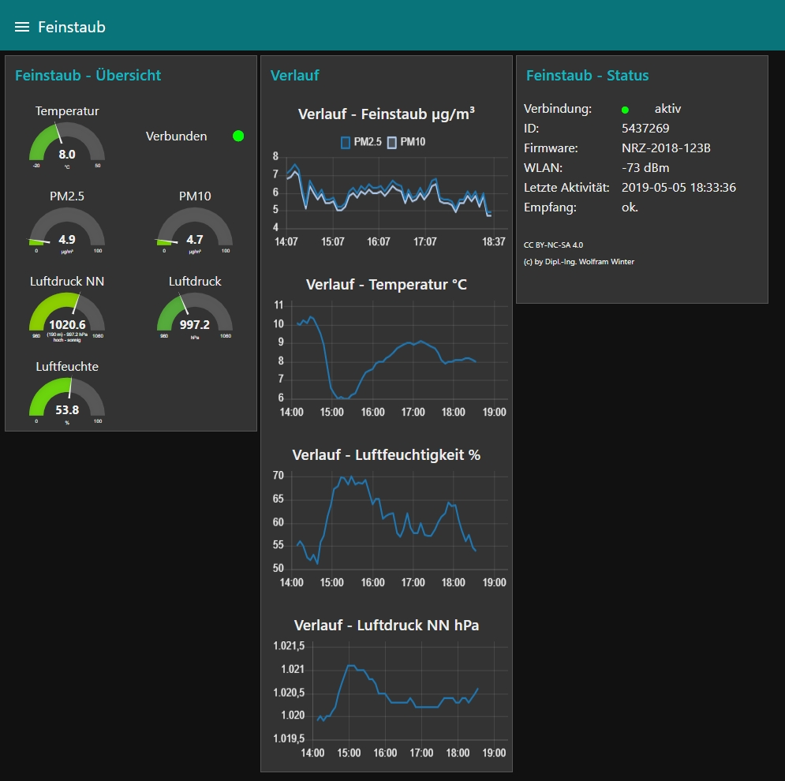
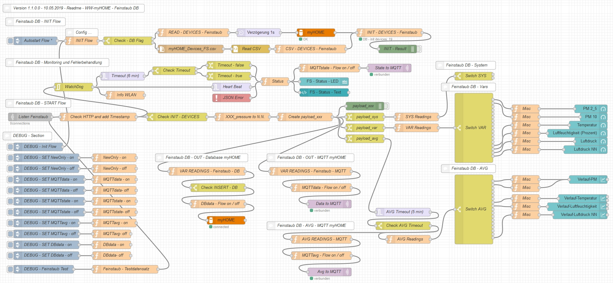
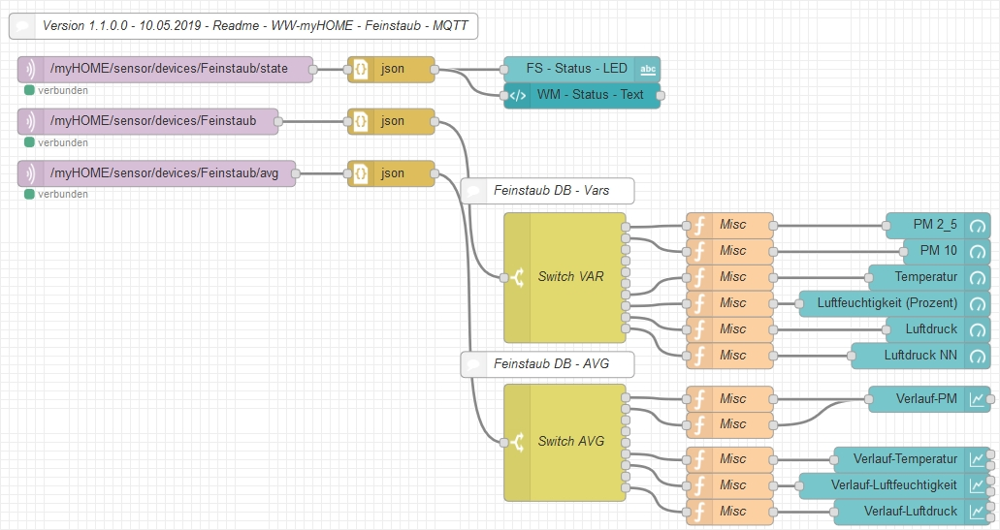

# WW-mySHT - Feinstaub

[Zurück zur Übersicht ...](../README.md)

### Funktion
Übernahme, Aufbereitung, Deployment und Visualisierung der per WiFi versandten Sensordaten der Feinstaub Messstation (https://luftdaten.info/) durch Node-RED

### Details
- Autarkes Teilmodul zur Übernahme / Abspeichern / MQTT-Deployment von Sensordaten
- die Sensordaten des Weatherman werden über den Port 8182 in Node-RED abgegriffen
  - dazu muss beim im Feinstaub Modul unter 'Konfiguration' eingestellt werden:
    - 'An eigene API senden' - angehakt
      - Server: <IP-NodeRED-Server\>
      - Pfad: /feinstaub
      - Port: 8182
- über globale Node-RED Flow-Konfigurationsparameter und eine CSV-Gerät/Sensor-Datei wird der Umfang der Installation festgelegt - dies geht von der einfachen Visualisierung der Messwerte bis hin zum MQTT-Versand und der Abspeicherung der Sensorwerte in einer SQL-Datenbank
- die myHOME-Konfiguration muss angelegt und für den Feinstaubsensor vorbereitet sein (CSV-Datei - siehe Doku dort)
- in der myHOME-Konfiguration befindet sich für jedes Gerät/Sensor/Wert ein Konfigurationssatz, über den u.a. gesteuert werden kann, was mit dem Datensatz geschehen soll - es kann konfiguriert werden ...
  - nur die Daten werden weiterverarbeitet, für die es einen Konfigurationseintrag gibt
  - über ein Aktiv-/Inaktiv-Flag kann ein Device-Datensatz von der Verarbeitung ein- oder ausgeschlossen werden
  - über ein Datenbank-Flag kann entschieden werden, ob der Device-Datensatz in der myHOME-Datenbank abgelegt wird
  - über ein MQTT-Flag kann entschieden werden, ob der Device-Datensatz per MQTT über den eingetragenen MQTT-Pfad versandt werden soll
  - alle Device-Angaben (Name, Bezeichnung, Einheiten, etc.) sind einzeln konfigurierbar
  - für den Feinstaubsensor werden die 'value_type'-Bezeichnungen neu 'normiert'
    - damit braucht keine Code-Anpassung der Folge-Prozesse mehr erfolgen, wenn bei einer Firmware-Änderung die 'name'-Einträge geändert werden - man muss nur die Konfiguration der Device-Parameter in der myHOME-Datenbank vornehmen (Doku siehe dort) - bei den Folgeprozessen bleiben die festgelegten Device Bezeichner erhalten
- es werden intern unterschiedliche 'payloads' generiert, die für eigene Entwicklungen genutzt werden können:
  - payload: Original Device-Objekte Weatherman
  - payload_sys: 'normierte' Device-Objekte der Weatherman Systemangaben
  - payload_var: 'normierte' Device-Objekte des Weatherman
  - payload_avg: 'normierte' Device-Objekte des Weatherman - ALLE numerischen Werte werden als 'gleitende Mittelwerte' im 5 Minuten-Intervall (einstellbar) bereitgestellt
  - payload_sql: SQL-Befehle zur Übernahme in die myHOME-Datenbank
  - payload_mqtt: 'normierte' Device-Objekte zur Übergabe an MQTT-Server
- Watchdog und JSON-Fehlerbehandlung mit Statusausgabe

### Setup
[Setup der 'Feinstaub' Sensordaten mit Node-RED](./SETUP.md)

### Node-RED - GUI

Gesamter Flow für alle Optionen mit Debug Optionen:

### Node-RED - FLOW

Gesamter Flow für alle Optionen mit Debug Möglichkeiten:

Flow für reine Node-RED GUI-Darstellung über MQTT:

### MQTT Feinstaub in FHEM

Feinstaub Daten in FHEM über MQTT Broker:

### Hardware Feinstaub-Modul

Feinstaub-Modul mit Selbstbau-Shield für BME280

### Auswertungen Feinstaub-Modul

[Link MDAVI - Feinstaub](https://www.madavi.de/sensor/graph.php?sensor=esp8266-5437269-sds011)

[Link MDAVI - Sensoren](https://www.madavi.de/sensor/graph.php?sensor=esp8266-5437269-bme280)

### Version
- 1.1.0.0 - 2019-05-10
  - Aktualisierung und Verifikation für Firmware 123B
- 1.0.0.0 - 2018-12-07
  - Erstausgabe
